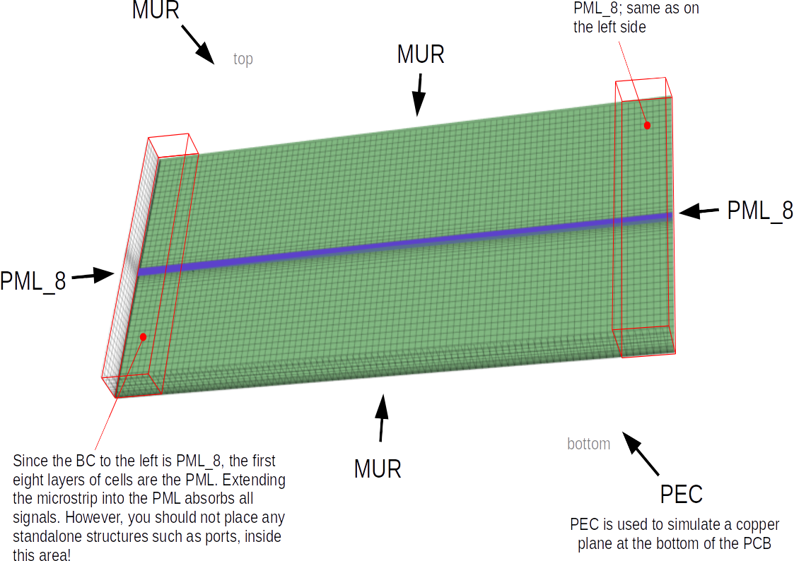

.. _boundarycond:

**********************************
Boundary Conditions
**********************************

The :doc:`mesh<meshing>` is on either side of each axis surrounded by one the four boundary conditions:

+--------+--------------------------------------------+
| PEC    | Perfect electric conductor                 |
+--------+--------------------------------------------+
| PMC    | Perfect magnetic conductor                 |
+--------+--------------------------------------------+
| MUR    | A simple absorbing boundary condition      |
+--------+--------------------------------------------+
| PML_x  | Perfectly matched layer of *x* cells       |
+--------+--------------------------------------------+

Perfect electric conductor (PEC)
============================================

All tangential electric fields on this boundary will be set to zero. This results in the behavior as a perfect electric conductor. This BC is the default in a FDTD simulation.

For example, this BC can be used to model waveguide walls or a infinite ground-plane for PCB board.

Perfect magnetic conductor (PMC)
============================================

All tangential magnetic fields on this boundary will be set to zero. This results in the behavior as a perfect magnetic conductor. Since there is no real material with such a behavior, it is usually used as symmetry boundary condition.

.. note:: Since in FDTD all magnetic fields are shifted by half a cell, this wall is effectively located in the middle of the last two lines of the respective direction.

Mur's Absorbing Boundary Condition (MUR)
============================================

A simple absorbing boundary condition.

Only works perfectly for a completely orthogonal impinging waves with a known phase-velocity (e.g. speed of light).

.. _bc_pmlx:

Perfectly Matched Layer (PML_x)
============================================

Artificial x-cells thick layer that effectively absorbs incoming EM waves.

PML thickness can be 6 to 20 cells. PML_8 is a good default (and is also used by default if not explicitly specified).

.. warning:: In openEMS the last *x* lines in the respective direction are defined as this artificial absorbing material. Keep your structures far enough away! See also example below.

Placement of e.g. excitations or probes can lead to convergence problems; see also the :doc:`troublehooting guide<troubleshooting>`.

.. note:: This boundary condition is not optimally implemented regarding the simulation speed. For faster simulations, use MUR instead of PML_x.

Microstrip Example
============================================

In the following example, a printed circuit board (PCB) substrate (green) with a microstrip trace (blue) is simulated:

	
	Boundary conditions around a PCB with a MSL

The EM field at the top is mostly affected by the first few layers of air above the PCB, so the boundary condition only has a minor influence, and is simply set to MUR. Same for the wide edges of the PCB (parallel to the microstrip).

The bottom of the PCB needs a GND layer, which can conveniently be provided by placing the substrate at the very end of the mesh, and setting the boundary condition to PEC (which simulates an ideal copper layer).

The narrow edges of the PCB (left, right) form the ends of the microstrip. No impedance discontinuity is desired at their ends, so a PML was chosen. In this example it is PML_8, so it occupies eight layers of cells. Care must be taken that the port excitation and probes of the microstrip are not inside that area. See also the :doc:`troublehooting guide<troubleshooting>`

.. tabs::
	
	.. tab:: Matlab/Octave
		
		.. code-block:: matlab
		  
			FDTD = InitFDTD();
			FDTD = SetBoundaryCond(FDTD, {'PML_8' 'PML_8' 'MUR' 'MUR' 'PEC' 'MUR'});
	
	.. tab:: Python
	
		.. code-block:: python
			
			FDTD = openEMS()
			FDTD.SetBoundaryCond(['PML_8', 'PML_8', 'MUR', 'MUR', 'PEC', 'MUR'])

This example is very similar to the :ref:`microstrip notch filter tutorial <tut_msl_notch_filter>`.

Further Reading
============================================

* `Perfectly matched layer (Wikipedia) <https://en.wikipedia.org/wiki/Perfectly_matched_layer>`_
