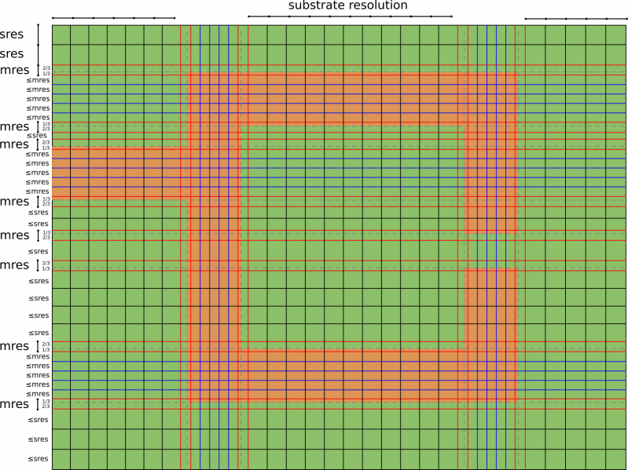

.. _meshing:

**********************************
Meshing
**********************************

.. todo::
	
	Meshing (import from Wiki)

     

General
===================

The mesh used by the finite-difference time-domain (FDTD) method is a strictly rectilinear mesh using Yee-cells.

For detailed information you should have a close look here: `Finite-difference time-domain method - Wikipedia <https://en.wikipedia.org/wiki/Finite-difference_time-domain_method>`_

Rules of Thumb
--------------------

Here are some (maybe) helpful rules of thumb:

.. hint::
    
    The largest mesh cell must not be bigger than about 1/10 of the smallest wavelength.

Better: :math:`max(\Delta_x,\Delta_y,\Delta_z) < \lambda_{min} / 15`

The smallest wavelength is defined by the greatest excited frequency, and by the material properties!

.. hint::
    
    Make the mesh as coarse as possible, and as fine as needed.

.. hint::
    
    Keep an adequate distance to any absorbing boundary condition.

Try to keep any structure :math:`> \lambda_{max} / 4` from a PML.

.. todo::

	Shouldn't this mean "from an absorbing BC"?
	If this is PML_x, does this mean my min. distance should be x+lambda/4?

Failure to do so might give unexpected results, see also :ref:`troubleshooting <troubleshooting>`.

.. hint::

    Create a smooth mesh: Neighboring cell sizes should not exceed a factor of ≈ 2.

.. todo::

	Any explanation why? Or in other words: what might happen if not?

.. hint::

    Thirds Rule: At the edges of a 2D metal you have a strong electric field enhancement that FDTD has trouble to calculate properly.

That means that e.g. for microstrip line (MSL), the line-impedance and wave propagation differs somewhat between simulation and measurement. So, it is preferred in precision calculation to put a mesh line 1/3 inside and 2/3 outside the metal.

A practical example for this can be seen in the :ref:`MSL notch filter tutorial <tut_msl_notch_filter>`.

FDTD Mesh example
----------------------

	
	Thirds rule explanation with a microstrip line

1. place the thirds rule mesh lines 1/3 inside and 2/3 outside the metal (the red lines).

2. place the metal mesh lines (the blue ones), which should cover all microstrip lines in the width direction with a maximum spacing of *mres* (the metal mesh resolution, e.g. :math:`mres \leq \lambda_{min} / 20`)

3. complete this mesh with substrate mesh lines (the black lines) which should cover all the substrate with a maximum spacing of *sres* (the substrate mesh resolution, e.g. :math:`mres \leq \lambda_{min} / 10`)

More mesh lines means longer simulation time, so try to add only necessary lines (sometimes, red or blue lines already cover the substrate mesh).

Script Example
--------------------

``SmoothMeshLines`` enables us to define meshes with points which match important dimensions and have an interval less than a specified maximum. This is demonstrated with the following simple examples.

* First, a simple mesh from 1 to 10 with a maximum resolution of 1:

	.. tabs::
		
		.. tab:: Matlab/Octave
			
			.. code-block:: matlab
			  
				>> SmoothMeshLines([1 10], 1)
				ans =
				 
					1    2    3    4    5    6    7    8    9   10
		
		.. tab:: Python
		
			.. todo::
				
				Python example missing

* Now suppose we want a point at 5.2. This is added to the vector (first argument):

	.. tabs::
		
		.. tab:: Matlab/Octave
			
			.. code-block:: matlab
			  
				>> SmoothMeshLines([1 5.2 10], 1)
				ans =
				 
				 Columns 1 through 8:
				 
					1.0000    1.8400    2.6800    3.5200    4.3600    5.2000    6.1600    7.1200
				 
				 Columns 9 through 11:
				 
					8.0800    9.0400   10.0000
		
		.. tab:: Python
		
			.. todo::
				
				Python example missing

* Create a homogeneous mesh with a resolution of 10mm in x- and y-direction and 15mm in z-direction:

	.. tabs::
		
		.. tab:: Matlab/Octave
			
			.. code-block:: matlab
			  
				CSX = InitCSX();
				mesh.x = 0:10:500;
				mesh.y = SmoothMeshLines([0 750], 10);
				mesh.z = SmoothMeshLines([0 2000], 15);
				CSX = DefineRectGrid(CSX, 1e-3 ,mesh); % define the mesh with a drawing unit of 1mm (1e-3)
		
		.. tab:: Python
		
			.. todo::
				
				Python example missing

FDTD Cylindrical Mesh
=======================

External resource: `JNM_2012_Liebig_Online.pdf <https://www.ate.uni-due.de/data/dokumente_2012/JNM_2012_Liebig_Online.pdf>`_ (requires login of Universität Duisburg Essen)

An adaption of the conventional FDTD algorithm to the cylindrical coordinate has been realized with only minimal changes. As in the rectilinear mesh, the Maxwell equations are evaluated on the surfaces and edges of cylindrical Yee cell but with different formulation in the calculation of surface area and edge lengths.

To reduce inevitable smaller cell size as r approaches 0 which induces smaller step size and hence slower simulation, a new multi-grid approach for cylindrical mesh is introduced. In contrast to conventional FDTD multi-grid that increases the mesh resolution, this method is adopted for reducing excessive mesh resolution in the center and its neighboring area. By introducing sub-grid, every second radial lines of the original mesh is excluded. This enlarge the relevant cell size and time step by a factor of two. For a huge number of mesh line in azimuthal direction, this approach can be nested several times. Correspond to it, the cell size and time step are increased by a factor of :math:`2^n`, where *n* is the number of nested stage.

Script Example
--------------------

Cylindrical mesh without subgrid:

	.. tabs::
		
		.. tab:: Matlab/Octave
			
			.. code-block:: matlab

				FDTD = InitFDTD(1e9, 1e-3, 'CoordSystem', 1);
				CSX = InitCSX('CoordSystem', 1);
				mesh.r= AutoSmoothMeshLines([0 200], 10);
				mesh.a= 0:2*pi/352:2*pi; % azimuthal equidistant  
				mesh.z= AutoSmoothMeshLines([-1000 1000], 15);
				CSX = DefineRectGrid(CSX, 1e-3, mesh); % define the mesh with a drawing unit of 1 mm
		
		.. tab:: Python
		
			.. todo::
				
				Python example missing

Cylindrical mesh with subgrid defined at r = 50 mm :

	.. tabs::
		
		.. tab:: Matlab/Octave
			
			.. code-block:: matlab

				FDTD = InitFDTD(1e9, 1e-3, 'CoordSystem', 1, 'MultiGrid', 50);
				CSX = InitCSX('CoordSystem', 1);
				mesh.r = AutoSmoothMeshLines([0 200], 10);
				mesh.a = 0:2*pi/352:2*pi; % azimuthal equidistant  
				mesh.z = AutoSmoothMeshLines([-1000 1000], 15);
				CSX = DefineRectGrid(CSX, 1e-3, mesh); % define the mesh with a drawing unit of 1 mm
		
		.. tab:: Python
		
			.. todo::
				
				Python example missing

Boundary Conditions
=========================

To complete the mesh, boundary conditions must be specified. This is explained :ref:`here <boundarycond>`.
