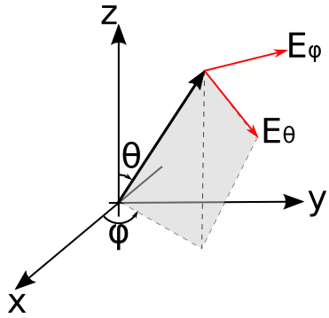

**********************************
NF2FF
**********************************

.. todo::
	
	Migrate from <http://openems.de/index.php/NF2FF.html>

Create and calculate the near-field to far-field transformation. The NF2FF box must be defined before running the FDTD simulations.

.. todo::
	
	All the arguments explained here have to go away. They are too Octave-specific.

NF2FF Creation
========================

The function ``CreateNF2FFBox`` will create surface dump-boxes surrounding the structure. The HDF5 file format is used to store the electric and magnetic fields necessary to perform the near-field to far-field transformation.

Create a near-field to far-field box:

	.. tabs::
		
		.. tab:: Matlab/Octave
			
			.. code-block:: matlab
			  
				[CSX nf2ff] = CreateNF2FFBox(CSX, name, start, stop, varargin)
		
		.. tab:: Python
		
			.. todo::
			
				Python missing

The parameters are:

    CSX
		The CSXCAD data structure to be manipulated.
    name
		The name of the nf2ff calculation, it will be part of the hdf5 dump filenames
    start/stop
		Start and stop coordinates of the NF2FF box; it should contain all structures and should not be inside the `boundary condition <coundarycond>`!

Return parameters are:

    CSX
		The manipulated CSXCAD data structure.
    nf2ff
		A data structure containing all necessary information to perform the near-field to far-field transformation. See CalcNF2FF below.

Optional/variable arguments are:

    Frequency: Specify a frequency vector to save disk-space. By default time-domain data will be stored.
    OptResolution: Dump fields only for a given optimal resolution (e.g.: 'OptResolution', c0/max_freq/unit/15) to save disk-space
    Directions: A 6x1 array, showing which directions are enabled/disabled for the NF2FF calculations. The numbers in the array represent [x(-), x(+), y(-), y(+), z(-), z(+)]. Each value can be either 1 (enabled) or 0 (disabled). Usually this is only used to disable some directions in case of a full cylindrical mesh. For a Cartesian mesh this should not be changed.

NF2FF Calculation
========================

Note:: This function can only be used after a simulation has been performed and all electric and magnetic fields have been stored as defined by CreateNF2FFBox.

IMPORTANT: Make sure to define the correct nf2ff phase center, aka. central antenna position! See optional parameter below!! Default is [0 0 0]

The function to calculate the far field is called by

nf2ff = CalcNF2FF(nf2ff, Sim_Path, freq, theta, phi, varargin)

The parameters are:

    nf2ff: data structure created by CreateNF2FFBox
    Sim_Path: path to simulation data
    freq: array of frequencies to analyze
    theta,phi: spherical coordinates to evaluate the far-field on (in radians)

Optional parameters are:

    Center: nf2ff phase center, default is [0 0 0]. Make sure the center is never outside of your nf2ff box. Unit is always meters.

    Mode
        'Mode', 0 -> read only, if data already exist (default)
        'Mode', 1 -> calculate anyway, overwrite existing
        'Mode', 2 -> read only, fail if not existing
    
    Outfile
		alternative nf2ff result hdf5 file name. Default is: *nf2ff.name*.h5
    Verbose
		set verbose level for the nf2ff calculation 0-2 supported

Output
========================

After performing the NF2FF calculations the nf2ff struct will look like:

::

	nf2ff = 

			   name: 'nf2ff'
		filenames_E: {'nf2ff_E_xn'  'nf2ff_E_xp'  'nf2ff_E_yn'  'nf2ff_E_yp'  'nf2ff_E_zn'  'nf2ff_E_zp'}
		filenames_H: {'nf2ff_H_xn'  'nf2ff_H_xp'  'nf2ff_H_yn'  'nf2ff_H_yp'  'nf2ff_H_zn'  'nf2ff_H_zp'}
		 directions: [6x1 double]
		CoordSystem: 0
				xml: 'Sphere_RCS_small/nf2ff.xml'
			   hdf5: 'Sphere_RCS_small/nf2ff.h5'
				  r: 1
			  theta: [181x1 double]
				phi: [361x1 double]
			   freq: [20x1 double]
			   Prad: [20x1 double]
			   Dmax: [20x1 double]
			E_theta: {1x20 cell}
			  E_phi: {1x20 cell}
			 E_norm: {1x20 cell}
			  P_rad: {1x20 cell}

	
	The field components of the far field: :math:`E_\theta` lies in the plane spanned by the Z-axis, and :math:`(\theta,\varphi); E_\varphi` is orthogonal to that

The content of the individual fields is as follows:

::

    name: The name of the NF2FF box used to calculate the far field.
    filenames_E: (internal) Filenames of all electric field dump boxes for each direction.
    filenames_H: (internal) Filenames of all magnetic field dump boxes for each direction.
    directions: (internal) A 6x1 array, showing which directions are enabled/disabled for the NF2FF calculations. The numbers in the array represent [x(-), x(+), y(-), y(+), z(-), z(+)]. Each value can be either 1 (enabled) or 0 (disabled).
    CoordSystem: (internal) Type of coordinate system for the raw field-data. Can be either a Cartesian (0) or a cylindrical (1) coordinate system.
    xml: (internal) Path to an xml-file which contains the values of analyzed frequencies and angles as well as the hdf5 file names where the fields are stored.
    hdf5: (internal) Path to the hdf5-file containing all the nf2ff calculated data
    r: Radius or distance to the phase center used for the nf2ff calculation (in meter).
    theta, phi: values of the polar angles of the calculated far field (\varphi, \theta)
    frequencies: values of the analyzed frequencies
    Prad: Total radiated power for each frequency (can be used for antenna efficiency calculation).
    Dmax: max. antenna directivity
    E_theta: Complex theta component of the electric far-field for each analyzed frequency and angle (E_\varphi(r, \varphi, \theta)).
    E_phi: Complex phi component of the electric far-field for each analyzed frequency and angle (E_\theta(r, \varphi, \theta)).
    E_cprh: (openEMS >v0.0.30) Complex amplitude of right-handed circular polarized electric far-field for each analyzed frequency and angle (E_{CPRH}(r, \varphi, \theta)).
    E_cplh: (openEMS >v0.0.30) Complex amplitude of left-handed circular polarized electric far-field for each analyzed frequency and angle (E_{CPLH}(r, \varphi, \theta)).
    E_norm: Complex electric field amplitude of the far-field for each analyzed frequency and angle (|E|(r, \varphi, \theta)).
    P_rad: The energy flux in the far field for each analyzed frequency and angle (P_{rad}(r, \varphi, \theta)).
