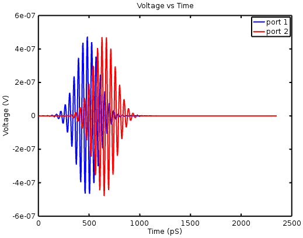
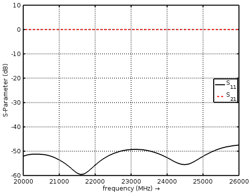
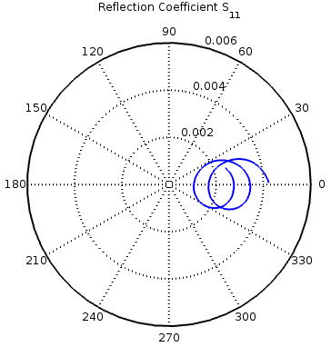
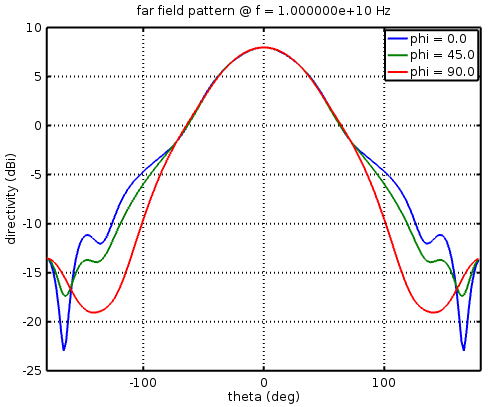
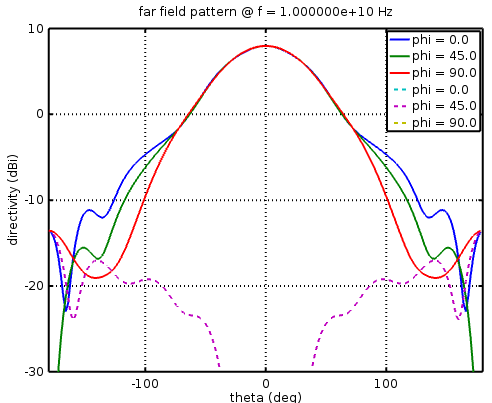

**********************************
Visualization of Results
**********************************

.. todo::
	
	port all the scripts (http://openems.de/index.php/Visualization_of_Results.html)

The simulation results can be viewed and analyzed in many ways using Matlab/Octave functions. Here are some examples.

Time Domain Signals
==========================

Here is an example of the voltage waveforms in the rectangular waveguide tutorial which has a section of waveguide with ports at each end. After the simulation is complete, the plot frequency range is defined and calcPort is run.

	.. tabs::
		
		.. tab:: Matlab/Octave
			
			.. code-block:: matlab
			  
				f_start = 20e9;
				f_0     = 24e9;
				f_stop  = 26e9;
				% ...
				freq = linspace(f_start,f_stop,201);
				port = calcPort(port, Sim_Path, freq);
		
		.. tab:: Python
		
			.. todo::
				
				Python example missing

The time values and the total voltage values are extracted from the data structures for the ports and plotted. The blue curve is the active port and the red curve shows the wave incident on the second port.

	.. tabs::
		
		.. tab:: Matlab/Octave
			
			.. code-block:: matlab
			  
				figure
				plot( 1e12*port{1}.ut.time, port{1}.ut.tot, 'b-', 'Linewidth', 2 );
				hold on
				plot( 1e12*port{1}.ut.time, port{2}.ut.tot, 'r-', 'Linewidth', 2 );
				title( 'Voltage vs Time' );
				xlabel( 'Time (pS)' );
				ylabel( 'Voltage (V)' );
				legend( 'port 1','port 2');
		
		.. tab:: Python
		
			.. todo::
				
				Python example missing

	
	Time-Domain plot

Frequency Domain Signals
==========================

Frequently in microwave engineering we want to view the s-parameters, just as we would with a vector network analyzer. Here is an example taken from the rectangular waveguide tutorial. After the simulation is complete, the plot frequency range is defined and calcPort is run. (Note that it should only be necessary to run calcPort once, and then numerous plots can be made from the port data structure.)

	.. tabs::
		
		.. tab:: Matlab/Octave
			
			.. code-block:: matlab
			  
				f_start = 20e9;
				f_0     = 24e9;
				f_stop  = 26e9;
				% ...
				freq = linspace(f_start,f_stop,201);
				port = calcPort(port, Sim_Path, freq);
		
		.. tab:: Python
		
			.. todo::
				
				Python example missing

Next, components of the port structure can be used in calculations and the results plotted. Here is the calculation of s11 and s21 using incident and reflected frequency-domain voltages:

	.. tabs::
		
		.. tab:: Matlab/Octave
			
			.. code-block:: matlab
			  
				s11 = port{1}.uf.ref./ port{1}.uf.inc;
				s21 = port{2}.uf.ref./ port{1}.uf.inc;
		
		.. tab:: Python
		
			.. todo::
				
				Python example missing

And the curves plotted in dB:

	.. tabs::
		
		.. tab:: Matlab/Octave
			
			.. code-block:: matlab
			  
				figure
				plot(freq*1e-6,20*log10(abs(s11)),'k-','Linewidth',2);
				xlim([freq(1) freq(end)]*1e-6);
				grid on;
				hold on;
				plot(freq*1e-6,20*log10(abs(s21)),'r--','Linewidth',2);
				l = legend('S_{11}','S_{21}','Location','East');
				set(l,'FontSize',12);
				ylabel('S-Parameter (dB)','FontSize',12);
				xlabel('frequency (MHz) \rightarrow','FontSize',12);
		
		.. tab:: Python
		
			.. todo::
				
				Python example missing

	
	S-Parameter plot

The reflection coefficient can also be plotted on a polar plot (Smith Chart). Note that in this example that the radius of the outer circle is much less than 1 because the waveguide is well matched and auto-scaling zooms into the centre of the plot.

	.. tabs::
		
		.. tab:: Matlab/Octave
			
			.. code-block:: matlab
			  
				polar(arg(s11), abs(s11));
				title( 'Reflection Coefficient S_{11}' );
		
		.. tab:: Python
		
			.. todo::
				
				Python example missing

	
	Polar plot

Radiation Patterns
===========================

For antennas, radiation patterns are an important property to plot. Assuming that the NF2FF box has been set up in the simulation, after the simulation the CalcNF2FF function transforms the near-field data at frequency f0 to far-field cuts over the range thetaRange on cuts phiCuts (in this case 0, 45, and 90 degrees).

	.. tabs::
		
		.. tab:: Matlab/Octave
			
			.. code-block:: matlab
			  
				thetaRange = (0:2:359) - 180;
				phiCuts = [0 45 90];
				nf2ff = CalcNF2FF(nf2ff, Sim_Path, f0, thetaRange*pi/180, phiCuts*pi/180);
		
		.. tab:: Python
		
			.. todo::
				
				Python example missing

The openEMS function plotFFdB plots the radiation patterns.

	.. tabs::
		
		.. tab:: Matlab/Octave
			
			.. code-block:: matlab
			  
				figure
				plotFFdB(nf2ff,'xaxis','theta','param',[1 2 3]);
				axis([-180 180]);
		
		.. tab:: Python
		
			.. todo::
				
				Python example missing

	
	Radiation Pattern Plot

However, plotFFdB plots :math:`|E|` which has the co- and cross-polarized components of the electric field combined, and antenna engineers often plot the two polarization responses as separate curves. Part of the structure returned by ``CalcNF2FF`` are orthogonal field components aligned in the phi direction and the theta direction. These components can be extracted with:

	.. tabs::
		
		.. tab:: Matlab/Octave
			
			.. code-block:: matlab
			  
				E_theta = nf2ff.E_theta{freq_index} / max(nf2ff.E_norm{freq_index}(:));
				E_phi = nf2ff.E_phi{freq_index} / max(nf2ff.E_norm{freq_index}(:));
		
		.. tab:: Python
		
			.. todo::
				
				Python example missing

Conversion to co and cross is straightforward:

	.. tabs::
		
		.. tab:: Matlab/Octave
			
			.. code-block:: matlab
			  
				% Convert from E_theta and E_phi to co- and cross-pol as per
				% Ludwig's third definition.
				% Ref.: Milligan, Modern Antenna Design, 2005, p.22
				% [ E_co] = [cos(phi)  -sin(phi)] [E_phi  ]
				% [ E_cx] = [sin(phi)   cos(phi)] [E_theta]
				 
				E_co = E_theta.*cos(nf2ff.phi) - E_phi.*sin(nf2ff.phi);
				E_cx = E_theta.*sin(nf2ff.phi) + E_phi.*cos(nf2ff.phi);
				 
				E_co_log = 20*log10(E_co) + 10*log10(nf2ff.Dmax(freq_index));
				E_cx_log = 20*log10(E_cx) + 10*log10(nf2ff.Dmax(freq_index));
		
			.. todo::
				
				Who is Ludwig? What's this referring to? Or is this just copypasta?
				
		.. tab:: Python
		
			.. todo::
				
				Python example missing

These can be plotted on a single graph with solid lines representing the co-polarized patterns and dashed lines the cross-polarized patterns.

	.. tabs::
		
		.. tab:: Matlab/Octave
			
			.. code-block:: matlab
			  
				xax = nf2ff.theta;
				yax1 = E_co_log(:,param);
				yax2 = E_cx_log(:,param);
				h = plot( xax/pi*180, yax1, xax/pi*180, yax2, '--' );
				
			(In this example ``param = [1 2 3]`` to specify the three phi-cuts.)
		
		.. tab:: Python
		
			.. todo::
				
				Python example missing

	
	Radiation pattern plot with co- and cross-polarized responses

A modified version of plotFFdB plots the co- and cross-polarized patterns: File:PlotFFcocx.m.

Field Dumps
==========================

Have a look into the :ref:`ParaView visualization tutorial <vis_paraview_tut>`.
