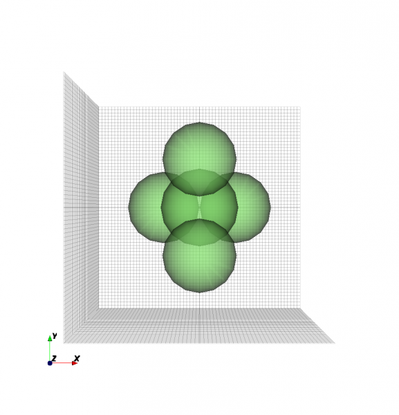

Sphere Aggregation
----------------------------

.. todo::

	Migrate from <http://openems.de/index.php/Sphere_Aggregation.html>

An aggregation of multiple spheres can easily be achieved. In this case there are 5 close packed spheres around the (0 0 0) point.

::

	CSX = AddMaterial( CSX, 'Diel' );
	CSX = SetMaterialProperty( CSX, 'Diel', 'Epsilon', 5, 'Mue', 1 );

	rad=150;
	x=rad*tan(pi/6);
	y=rad/cos(pi/6);
	z=sqrt(x^2+y^2);

	coords=[[-rad 0 -(x+y)/2]; [rad 0 -(x+y)/2]; [0 0 (x+y)/2]; [0 z 0]; [0 -z 0]];

	for i=1:length(coords(:,1)),
		CSX = AddSphere(CSX,'Diel',1,coords(i,:),rad);
	end

	
	5spheres.png
