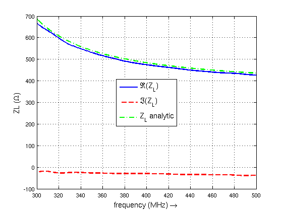
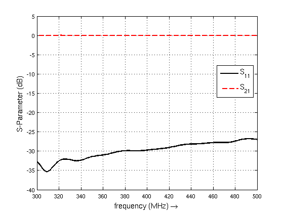

Circular Waveguide
==============================

Preface
-----------------------
     
Covered in this tutorial:

* Setting up a cylindrical mesh

* Setup a mode profile excitation

* Create voltage and current probes using the mode profile

* Calculate the waveguide impedance and S-Parameter

Simulation time: ≈ 7 minutes (for a 2 m long waveguide) on a contemporary machine

Prerequisites
-----------------------

* make sure you read the :ref:`tutorials primer<tutorials_primer>`

* open the tutorial file

  * Matlab/Octave: ``Circ_Waveguide.m``

  * Python: ``???.py``

Instructions
-----------------------

Setup
^^^^^^^^^^^^^^^^^^^^^^^

1. Start the script within an empty environment:

	.. tabs::
		
		.. tab:: Matlab/Octave
			
			.. code-block:: matlab
			  
				close all
				clear
				clc
		
		.. tab:: Python
		
			.. todo::
			
				Python missing

2. Setup the simulation parameters

	.. tabs::
		
		.. tab:: Matlab/Octave
			
			.. code-block:: matlab
			  
				physical_constants;
				unit = 1e-3; %drawing unit in mm
				 
				% waveguide dimensions
				length = 2000;
				rad = 350;     %waveguide radius in mm
				 
				% frequency range of interest
				f_start =  300e6;
				f_stop  =  500e6;
				 
				mesh_res = [10 2*pi/49.999 10]; %targeted mesh resolution
		
		.. tab:: Python
		
			.. todo::
			
				Python missing

3. Set cylindrical FDTD parameters and the Gaussian excitation pulse

	.. tabs::
		
		.. tab:: Matlab/Octave
			
			.. code-block:: matlab
			  
				FDTD = InitFDTD('EndCriteria',1e-4,'CoordSystem',1);
				FDTD = SetGaussExcite(FDTD,0.5*(f_start+f_stop),0.5*(f_stop-f_start));
				 
				% boundary conditions
				BC = [0 0 0 0 3 3]; %pml in pos. and neg. z-direction
				FDTD = SetBoundaryCond(FDTD,BC);
		
		.. tab:: Python
		
			.. todo::
			
				Python missing

4. Define the cylindrical homogeneous mesh

	.. tabs::
		
		.. tab:: Matlab/Octave
			
			.. code-block:: matlab
			  
				CSX = InitCSX('CoordSystem',1); % init a cylindrical mesh
				mesh.r = SmoothMeshLines([0 rad], mesh_res(1)); %mesh in radial direction
				mesh.a = SmoothMeshLines([0 2*pi], mesh_res(2)); % mesh in azimuthal dir.
				mesh.z = SmoothMeshLines([0 length], mesh_res(3));
				CSX = DefineRectGrid(CSX, unit,mesh);
		
		.. tab:: Python
		
			.. todo::
			
				Python missing

5. Apply waveguide ports

	.. tabs::
		
		.. tab:: Matlab/Octave
			
			.. code-block:: matlab
			  
				start=[mesh.r(1)   mesh.a(1)   mesh.z(8)];
				stop =[mesh.r(end) mesh.a(end) mesh.z(15)];
				[CSX, port{1}] = AddCircWaveGuidePort( CSX, 0, 1, start, stop, rad*unit, 'TE11', 0, 1);
				 
				start=[mesh.r(1)   mesh.a(1)   mesh.z(end-13)];
				stop =[mesh.r(end) mesh.a(end) mesh.z(end-14)];
				[CSX, port{2}] = AddCircWaveGuidePort( CSX, 0, 2, start, stop, rad*unit, 'TE11');
		
		.. tab:: Python
		
			.. todo::
			
				Python missing

6. Define a dump box using the HDF5 file format

	.. tabs::
		
		.. tab:: Matlab/Octave
			
			.. code-block:: matlab
			  
				CSX = AddDump(CSX,'Et','FileType',1,'SubSampling','4,4,4');
				start = [mesh.r(1)   mesh.a(1)   mesh.z(1)];
				stop  = [mesh.r(end) mesh.a(end) mesh.z(end)];
				CSX = AddBox(CSX,'Et',0 , start,stop);
		
		.. tab:: Python
		
			.. todo::
			
				Python missing

7. Save & Run the simulation

	.. tabs::
		
		.. tab:: Matlab/Octave
			
			.. code-block:: matlab
			  
				Sim_Path = 'tmp';
				Sim_CSX = 'circ_wg.xml';
				 
				[status, message, messageid] = rmdir(Sim_Path,'s');
				[status, message, messageid] = mkdir(Sim_Path);
				 
				WriteOpenEMS([Sim_Path '/' Sim_CSX],FDTD,CSX);
				 
				RunOpenEMS(Sim_Path, Sim_CSX)
		
		.. tab:: Python
		
			.. todo::
			
				Python missing

Post-Processing
^^^^^^^^^^^^^^^^^^^^^^^

8. Calculate S-parameters and waveguide impedance

	.. tabs::
		
		.. tab:: Matlab/Octave
			
			.. code-block:: matlab
			  
				freq = linspace(f_start,f_stop,201);
				port = calcPort( port, Sim_Path, freq);
				 
				s11 = port{1}.uf.ref./ port{1}.uf.inc;
				s21 = port{2}.uf.ref./ port{1}.uf.inc;
				ZL = port{1}.uf.tot./port{1}.if.tot;
		
		.. tab:: Python
		
			.. todo::
			
				Python missing

9. Plot S-Parameters

	.. tabs::
		
		.. tab:: Matlab/Octave
			
			.. code-block:: matlab
			  
				figure
				plot(freq*1e-6,20*log10(abs(s11)),'k-','Linewidth',2);
				xlim([freq(1) freq(end)]*1e-6);
				grid on;
				hold on;
				plot(freq*1e-6,20*log10(abs(s21)),'r--','Linewidth',2);
				l = legend('S_{11}','S_{21}','Location','Best');
				set(l,'FontSize',12);
				ylabel('S-Parameter (dB)','FontSize',12);
				xlabel('frequency (MHz) \rightarrow','FontSize',12);
		
		.. tab:: Python
		
			.. todo::
			
				Python missing

10. Compare analytic and numerical wave-impedance

	.. tabs::
		
		.. tab:: Matlab/Octave
			
			.. code-block:: matlab
			  
				figure
				plot(freq*1e-6,real(ZL),'Linewidth',2);
				hold on;
				grid on;
				plot(freq*1e-6,imag(ZL),'r--','Linewidth',2);
				plot(freq*1e-6,port{1}.ZL,'g-.','Linewidth',2);
				ylabel('ZL (\Omega)','FontSize',12);
				xlabel('frequency (MHz) \rightarrow','FontSize',12);
				xlim([freq(1) freq(end)]*1e-6);
				l = legend('\Re(Z_L)','\Im(Z_L)','Z_L analytic','Location','Best');
				set(l,'FontSize',12);
		
		.. tab:: Python
		
			.. todo::
			
				Python missing

Results
^^^^^^^^^^^^^^^

	
	Waveguide line impedance

	
	Waveguide scattering parameters

Further Steps
-------------------------------

* Try different/multiple modes for excitation/detection
* Add an unsymmetrical dielectric material load to see a mode-conversion (multiple mode detection necessary)
* Try adding a periodic dielectric material to see a frequency selective reflection (Bragg reflections)
