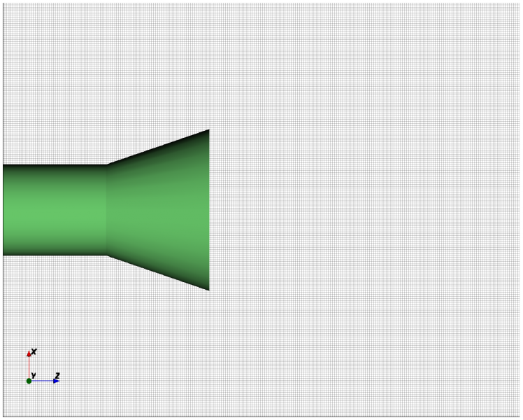
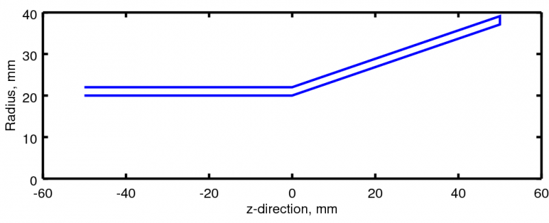
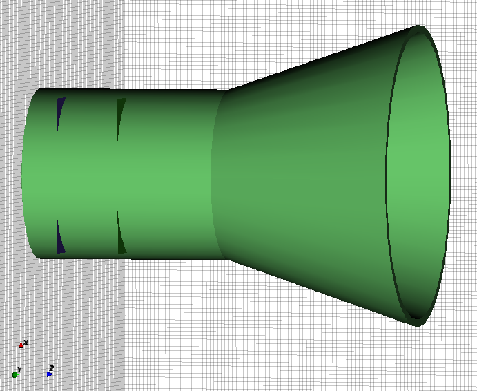
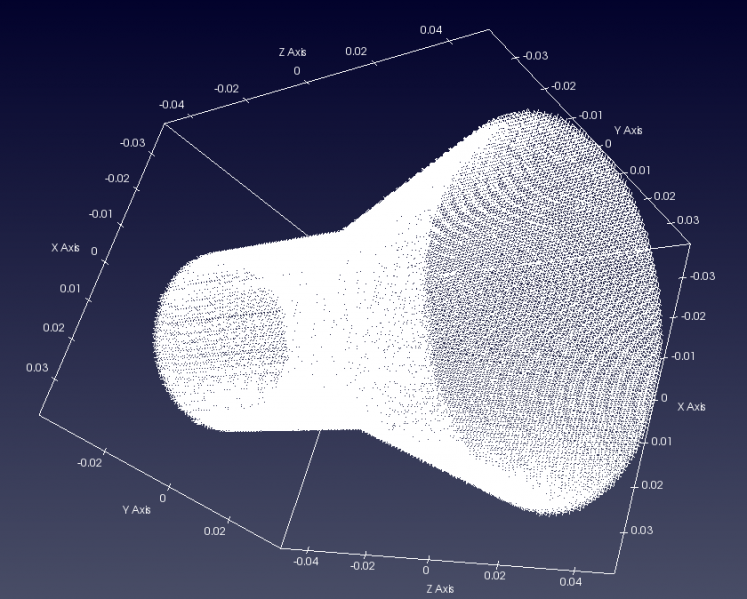
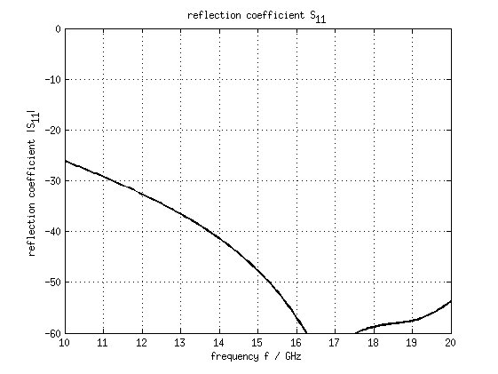
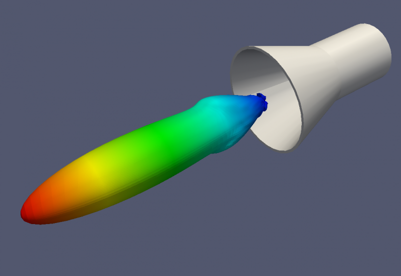

Conical Horn Antenna
==============================

Preface
-----------------------
     
Covered in this tutorial:

* Setup conical horn antenna using a rotated polygon
* Setup a rectangular feeding port
* Adding a near-field to far-field (nf2ff) box
* Calculate the S-Parameter of the antenna
* Calculate and plot the far-field pattern

Simulation time: ≈ 10 minutes on a contemporary machine, plus ≈ 1 hour for the far-field calculation

Prerequisites
-----------------------

* make sure you read the :ref:`tutorials primer<tutorials_primer>`

* open the tutorial file

  * Matlab/Octave: ``Conical_Horn_Antenna.m``

  * Python: ``???.py``

Instructions
-----------------------

1. Prepare the environment:

	.. tabs::
		
		.. tab:: Matlab/Octave
			
			.. code-block:: matlab
			  
				close all
				clear
				clc
		
		.. tab:: Python
		
			.. todo::
			
				Python missing

2. Setup the simulation parameters

	.. tabs::
		
		.. tab:: Matlab/Octave
			
			.. code-block:: matlab
			  
				physical_constants;
				unit = 1e-3; % all length in mm
		
		.. tab:: Python
		
			.. todo::
			
				Python missing

3. Specify the conical horn model parameters

	.. tabs::
		
		.. tab:: Matlab/Octave
			
			.. code-block:: matlab
			  
				% horn radius
				horn.radius  = 20; 
				% horn length in z-direction
				horn.length = 50;
				horn.feed_length = 50; 
				horn.thickness = 2;
				 
				% horn opening angle
				horn.angle = 20*pi/180;
		
		.. tab:: Python
		
			.. todo::
			
				Python missing

		Note that horn.radius is actually the radius of the circular waveguide which feeds the horn.

		The parameter horn.feed_length is the length of the circular waveguide.

		The thickness of the metal which forms the horn is set by horn.thickness.

4. Specify the simulation parameters

	.. tabs::
		
		.. tab:: Matlab/Octave
			
			.. code-block:: matlab
			  
				% size of the simulation box
				SimBox = [100 100 100]*2;
				 
				% frequency range of interest
				f_start =  10e9;
				f_stop  =  20e9;
				 
				% frequency of interest
				f0 = 15e9;
				 
				%% setup FDTD parameter & excitation function
				FDTD = InitFDTD( 'NrTS', 30000, 'EndCriteria', 1e-4 );
				FDTD = SetGaussExcite(FDTD,0.5*(f_start+f_stop),0.5*(f_stop-f_start));
				BC = {'PML_8' 'PML_8' 'PML_8' 'PML_8' 'PML_8' 'PML_8'}; % boundary conditions
				FDTD = SetBoundaryCond( FDTD, BC );
		
		.. tab:: Python
		
			.. todo::
			
				Python missing

5. Define the mesh

	.. tabs::
		
		.. tab:: Matlab/Octave
			
			.. code-block:: matlab
			  
				%% setup CSXCAD geometry & mesh
				% currently, openEMS cannot automatically generate a mesh
				max_res = c0 / (f_stop) / unit / 15; % cell size: lambda/20
				CSX = InitCSX();
				 
				%create fixed lines for the simulation box, substrate and port
				mesh.x = [-SimBox(1)/2 -horn.radius 0 horn.radius SimBox(1)/2];
				mesh.x = SmoothMeshLines( mesh.x, max_res, 1.4); % create a smooth mesh between specified fixed mesh lines
				 
				mesh.y = mesh.x;
				 
				%create fixed lines for the simulation box and given number of lines inside the substrate
				mesh.z = [-horn.feed_length 0 SimBox(3) ];
				mesh.z = SmoothMeshLines( mesh.z, max_res, 1.4 );
				 
				CSX = DefineRectGrid( CSX, unit, mesh );
		
		.. tab:: Python
		
			.. todo::
			
				Python missing

	Note that the mesh in the z-direction does not cover the range set by SimBox: the mesh starts at -horn.feed_length and goes to +200.

	Even though the horn is rotationally symmetric, a rectangular grid is still used.

	
	Image of the model mesh in the x-z plane

6. Specify the geometry of the horn and the waveguide feed

	.. tabs::
		
		.. tab:: Matlab/Octave
			
			.. code-block:: matlab
			  
				% horn + waveguide, defined by a rotational polygon
				CSX = AddMetal(CSX, 'Conical_Horn');
				p(1,1) = horn.radius+horn.thickness;   % x-coord point 1
				p(2,1) = -horn.feed_length;     % z-coord point 1
				p(1,end+1) = horn.radius+horn.thickness;   % x-coord point 1
				p(2,end) = 0;     % z-coord point 1
				p(1,end+1) = horn.radius+horn.thickness + sin(horn.angle)*horn.length; % x-coord point 2
				p(2,end) = horn.length; % y-coord point 2
				p(1,end+1) = horn.radius + sin(horn.angle)*horn.length; % x-coord point 2
				p(2,end) = horn.length; % y-coord point 2
				p(1,end+1) = horn.radius;  % x-coord point 1
				p(2,end) = 0;     % z-coord point 1
				p(1,end+1) = horn.radius;   % x-coord point 1
				p(2,end) = -horn.feed_length;     % z-coord point 1
				CSX = AddRotPoly(CSX,'Conical_Horn',10,'x',p,'z');
				 
				% horn aperture
				A = pi*((horn.radius + sin(horn.angle)*horn.length)*unit)^2;
		
		.. tab:: Python
		
			.. todo::
			
				Python missing

	
	Polygon which is rotated about the Z-axis to generate the conical horn model

7. Define the excitation

	.. tabs::
		
		.. tab:: Matlab/Octave
			
			.. code-block:: matlab
			  
				start=[-horn.radius -horn.radius mesh.z(10) ];
				stop =[+horn.radius +horn.radius mesh.z(1)+horn.feed_length/2 ];
				[CSX, port] = AddCircWaveGuidePort( CSX, 0, 1, start, stop, horn.radius*unit, 'TE11', 0, 1);
		
		.. tab:: Python
		
			.. todo::
			
				Python missing

The circular waveguide port runs from z = -41.176 to -25.

8. Set up field storage and run simulation

	.. tabs::
		
		.. tab:: Matlab/Octave
			
			.. code-block:: matlab
			  
				CSX = AddDump(CSX,'Exc_dump');
				start=[-horn.radius -horn.radius mesh.z(8)];
				stop =[+horn.radius +horn.radius mesh.z(8)];
				CSX = AddBox(CSX,'Exc_dump',0,start,stop);
				 
				%% nf2ff calc
				start = [mesh.x(9) mesh.y(9) mesh.z(9)];
				stop  = [mesh.x(end-8) mesh.y(end-8) mesh.z(end-8)];
				[CSX nf2ff] = CreateNF2FFBox(CSX, 'nf2ff', start, stop, 'Directions', [1 1 1 1 0 1]);
				 
				%% prepare simulation folder
				Sim_Path = 'tmp';
				Sim_CSX = 'horn_ant.xml';
				 
				[status, message, messageid] = rmdir( Sim_Path, 's' ); % clear previous directory
				[status, message, messageid] = mkdir( Sim_Path ); % create empty simulation folder
				 
				%% write openEMS compatible xml-file
				WriteOpenEMS( [Sim_Path '/' Sim_CSX], FDTD, CSX );
				 
				%% show the structure
				CSXGeomPlot( [Sim_Path '/' Sim_CSX] );
				 
				%% run openEMS
				RunOpenEMS( Sim_Path, Sim_CSX);
		
		.. tab:: Python
		
			.. todo::
			
				Python missing

		Note in the ``CreateNF2FFBox`` command that the -Z direction has been disabled because the model touches the -Z boundary of the simulation space.

		Polygon which is rotated about the z-axis to generate the conical horn model.

	
	Model of the conical horn; the corners of the planes which define the waveguide port can be seen protruding from the circular waveguide

Polygon which is rotated about the z-axis to generate the conical horn model.

	
	Gridded model of the conical horn

9. Postprocessing

	.. tabs::
		
		.. tab:: Matlab/Octave
			
			.. code-block:: matlab
			  
				%% postprocessing & do the plots
				freq = linspace(f_start,f_stop,201);
				 
				port = calcPort(port, Sim_Path, freq);
				 
				Zin = port.uf.tot ./ port.if.tot;
				s11 = port.uf.ref ./ port.uf.inc;
				 
				% plot reflection coefficient S11
				figure
				plot( freq/1e9, 20*log10(abs(s11)), 'k-', 'Linewidth', 2 );
				ylim([-60 0]);
				grid on
				title( 'reflection coefficient S_{11}' );
				xlabel( 'frequency f / GHz' );
				ylabel( 'reflection coefficient |S_{11}|' );
				 
				drawnow
				 
				%% NFFF contour plots %%%%%%%%%%%%%%%%%%%%%%%%%%%%%%%%%%%%%%%%%%%%%%%%%%%%
				 
				% calculate the far field at phi=0 degrees and at phi=90 degrees
				thetaRange = (0:2:359) - 180;
				disp( 'calculating far field at phi=[0 90] deg...' );
				nf2ff = CalcNF2FF(nf2ff, Sim_Path, f0, thetaRange*pi/180, [0 90]*pi/180);
				 
				Dlog=10*log10(nf2ff.Dmax);
				G_a = 4*pi*A/(c0/f0)^2;
				e_a = nf2ff.Dmax/G_a;
				 
				% display some antenna parameter
				disp( ['radiated power: Prad = ' num2str(nf2ff.Prad) ' Watt']);
				disp( ['directivity: Dmax = ' num2str(Dlog) ' dBi'] );
				disp( ['aperture efficiency: e_a = ' num2str(e_a*100) '%'] );
				 
				%%
				% normalized directivity
				figure
				plotFFdB(nf2ff,'xaxis','theta','param',[1 2]);
				drawnow
				%   D_log = 20*log10(nf2ff.E_norm{1}/max(max(nf2ff.E_norm{1})));
				%   D_log = D_log + 10*log10(nf2ff.Dmax);
				%   plot( nf2ff.theta, D_log(:,1) ,'k-', nf2ff.theta, D_log(:,2) ,'r-' );
				 
				% polar plot
				figure
				polarFF(nf2ff,'xaxis','theta','param',[1 2],'logscale',[-40 20], 'xtics', 12);
				drawnow
				%   polar( nf2ff.theta, nf2ff.E_norm{1}(:,1) )
				 
				%% calculate 3D pattern
				phiRange = sort( unique( [-180:5:-100 -100:2.5:-50 -50:1:50 50:2.5:100 100:5:180] ) );
				thetaRange = sort( unique([ 0:1:50 50:2.:100 100:5:180 ]));
				 
				disp( 'calculating 3D far field...' );
				nf2ff = CalcNF2FF(nf2ff, Sim_Path, f0, thetaRange*pi/180, phiRange*pi/180, 'Verbose',2,'Outfile','nf2ff_3D.h5');
				 
				figure
				plotFF3D(nf2ff);        % plot liear 3D far field
				 
				%%
				E_far_normalized = nf2ff.E_norm{1}/max(nf2ff.E_norm{1}(:));
				DumpFF2VTK([Sim_Path '/Conical_Horn_Pattern.vtk'],E_far_normalized,thetaRange,phiRange,'scale',1e-3);
		
		.. tab:: Python
		
			.. todo::
			
				Python missing

Results
====================

	
	Antenna return loss
	

	
	Antenna structure and radiation pattern

