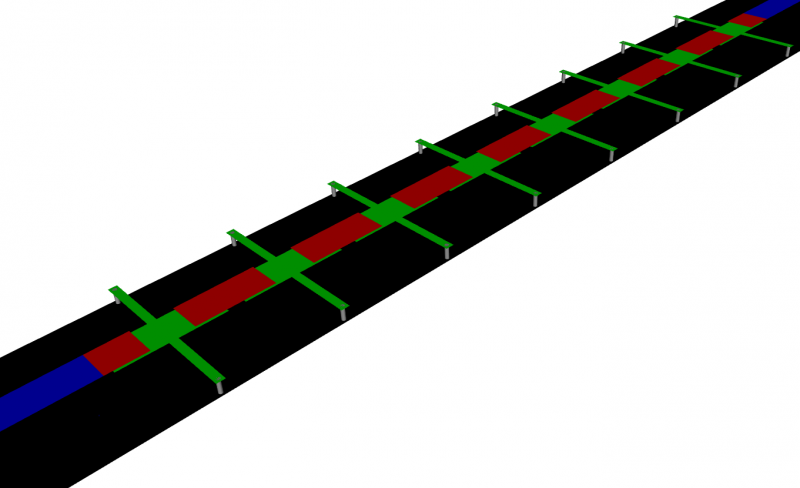
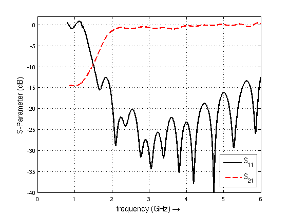
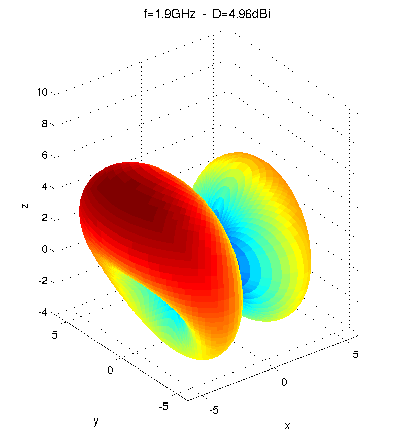

CRLH Leaky Wave Antenna
==============================

Preface
-----------------------
     
Covered in this tutorial:

* Setup a feeding microstrip line & port
* Use an external script to setup several composite right/left handed (CRLH) unit cell
* Calculate the radiation pattern

Simulation time: ≈ 30 minutes on a contemporary machine, plus ≈ 7 hours for radiation pattern post-processing

	
	Setup for the CRLH leaky wave antenna with 8 unit cells

Prerequisites
-----------------------

* make sure you read the :ref:`tutorials primer<tutorials_primer>`

* you may have a look at the :ref:`tutorial introducing a CRLH unit cell extraction <crlh_param_extr_tut>`

* open the tutorial files

  * Matlab/Octave: ``CRLH_LeakyWaveAnt.m`` and ``CreateCRLH.m``

  * Python: ``???.py``

Instructions
-----------------------

Setup
^^^^^^^^^^^^^^^^^^^^^^

1. Start the script within an empty environment:

	.. tabs::
		
		.. tab:: Matlab/Octave
			
			.. code-block:: matlab
			  
				close all
				clear
				clc
		
		.. tab:: Python
		
			.. todo::
			
				Python missing

2. Setup the simulation and geometric parameters

	.. tabs::
		
		.. tab:: Matlab/Octave
			
			.. code-block:: matlab
			  
				physical_constants;
				unit = 1e-6; % specify everything in um
				 
				feed_length = 20000;
				 
				substrate_thickness = [1524 101 254];
				substrate_epsr = [3.48 3.48 3.48];
				 
				N_Cells = 8;        %number of CRLH unit cells
				 
				CRLH.LL = 14e3;     %CRLH totel (line) length
				CRLH.LW = 4e3;      %CRLH unit cell width (without the stubs)
				CRLH.GLB = 1950;    %CRLH gap width bottom layer
				CRLH.GLT = 4700;    %CRLH gap width top layer
				CRLH.SL = 7800;     %CRLH stub length (bottom layer, both sides)
				CRLH.SW = 1000;     %CRLH stub width  (bottom layer, both sides)
				CRLH.VR = 250;      %CRLH via hole radius (stub -> ground)
				CRLH.TopSig = sum(substrate_thickness);  %top layer height
				CRLH.BottomSig = CRLH.TopSig - substrate_thickness(end);  %bottom layer height
				 
				substrate_width = CRLH.LW + 2*CRLH.SL;
				Air_Spacer = 25000;
				 
				% frequency range of interest
				f_start = 0.8e9;
				f_stop  = 6e9;
				 
				f_rad = (1.9:0.1:4.2)*1e9;
				 
				Plot_3D_Rad_Pattern = 0; %this may take a very very long time! > 7h
		
		.. tab:: Python
		
			.. todo::
			
				Python missing

3. Setup the FDTD parameter including the excitation time signal and boundary conditions

	.. tabs::
		
		.. tab:: Matlab/Octave
			
			.. code-block:: matlab
							  
				FDTD = InitFDTD( 20000 );
				FDTD = SetGaussExcite( FDTD, (f_start+f_stop)/2, (f_stop-f_start)/2 );
				BC   = {'PML_8' 'PML_8' 'PML_8' 'PML_8' 'PML_8' 'PML_8'};
				FDTD = SetBoundaryCond( FDTD, BC );
		
		.. tab:: Python
		
			.. todo::
			
				Python missing

4. Setup the inhomogeneous FDTD mesh and the CRLH unit cells

	.. tabs::
		
		.. tab:: Matlab/Octave
			
			.. code-block:: matlab
				
				CSX = InitCSX();
				resolution = c0/(f_stop*sqrt(max(substrate_epsr)))/unit /30; % resolution of lambda/30
				 
				mesh.x = [-feed_length-(N_Cells*CRLH.LL)/2-Air_Spacer -feed_length-(N_Cells*CRLH.LL)/2 0 feed_length+(N_Cells*CRLH.LL)/2 feed_length+(N_Cells*CRLH.LL)/2+Air_Spacer];
				mesh.y = [-Air_Spacer-substrate_width/2 0 Air_Spacer+substrate_width/2];
				substratelines = cumsum(substrate_thickness);
				mesh.z = [-0.7*Air_Spacer 0 cumsum(substrate_thickness) linspace(substratelines(end-1),substratelines(end),4) Air_Spacer];
				 
				% create the CRLH unit cells (will define additional fixed mesh lines)
				pos_x = -(N_Cells*CRLH.LL)/2 + CRLH.LL/2;
				for n=1:N_Cells
					[CSX mesh] = CreateCRLH(CSX, mesh, CRLH, resolution/4, [pos_x 0 0]);
					pos_x = pos_x + CRLH.LL;
				end
				 
				% Smooth the given mesh
				mesh.x = SmoothMeshLines(mesh.x, resolution, 1.5, 0);
				mesh.y = SmoothMeshLines(mesh.y, resolution, 1.5, 0);
				mesh.z = SmoothMeshLines(mesh.z, resolution, 1.5, 0);
				CSX = DefineRectGrid( CSX, unit, mesh );
		
		.. tab:: Python
		
			.. todo::
			
				Python missing

5. A closer look inside the CreateCRLH function

	This function will add all the necessary metal objects composing a CRLH unit cell. Additionally it will add appropriate mesh lines as needed for a smooth mesh including a thin metal handling.

	.. tabs::
		
		.. tab:: Matlab/Octave
			
			.. code-block:: matlab
			  
				function [CSX mesh] = CreateCRLH(CSX, mesh, CRLH, resolution, translate)
				 
				if (nargin<5)
					translate = [0 0 0];
				end
				 
				CSX = AddMetal(CSX, 'metal_top');
				one_two_third = [-resolution/3 2*resolution/3];
				 
				start = [-CRLH.LL/2 -CRLH.LW/2 CRLH.TopSig]+translate;
				stop  = [-CRLH.GLT/2  CRLH.LW/2 CRLH.TopSig]+translate;
				CSX = AddBox(CSX, 'metal_top', 10, start, stop);
				mesh.x = [mesh.x start(1) stop(1)+one_two_third];
				mesh.y = [mesh.y start(2)-one_two_third stop(2)+one_two_third];
				 
				start = [+CRLH.LL/2  -CRLH.LW/2 CRLH.TopSig]+translate;
				stop  = [+CRLH.GLT/2  CRLH.LW/2 CRLH.TopSig]+translate;
				CSX = AddBox(CSX, 'metal_top', 10, start, stop);
				mesh.x = [mesh.x start(1) stop(1)-one_two_third];
				 
				CSX = AddMetal(CSX, 'metal_bot');
				start = [-(CRLH.LL-CRLH.GLB)/2 -CRLH.LW/2 CRLH.BottomSig]+translate;
				stop  = [+(CRLH.LL-CRLH.GLB)/2  CRLH.LW/2 CRLH.BottomSig]+translate;
				CSX = AddBox(CSX, 'metal_bot', 10, start, stop);
				mesh.x = [mesh.x start(1)-one_two_third stop(1)+one_two_third];
				 
				start = [-CRLH.SW/2 -CRLH.LW/2-CRLH.SL CRLH.BottomSig]+translate;
				stop  = [+CRLH.SW/2  CRLH.LW/2+CRLH.SL CRLH.BottomSig]+translate;
				CSX = AddBox(CSX, 'metal_bot', 10, start, stop);
				mesh.x = [mesh.x start(1)-one_two_third stop(1)+one_two_third];
				mesh.y = [mesh.y start(2) stop(2)];
				 
				CSX = AddMetal(CSX, 'via');
				start = [0 -CRLH.LW/2-CRLH.SL+CRLH.SW/2 0]+translate;
				stop  = [0 -CRLH.LW/2-CRLH.SL+CRLH.SW/2 CRLH.BottomSig]+translate;
				CSX = AddCylinder(CSX, 'via', 10, start, stop, CRLH.VR);
				mesh.x = [mesh.x start(1)+[-1 0 1]*CRLH.VR];
				mesh.y = [mesh.y start(2)+[-1 0 1]*CRLH.VR];
				 
				start(2) = -start(2);
				stop(2)  = -stop(2);
				CSX = AddCylinder(CSX, 'via', 10, start, stop, CRLH.VR);
				mesh.y = [mesh.y start(2)+[-1 0 1]*CRLH.VR];
				end
		
		.. tab:: Python
		
			.. todo::
			
				Python missing

6. Add the substrate layer

	.. tabs::
		
		.. tab:: Matlab/Octave
			
			.. code-block:: matlab
			  
				substratelines = [0 substratelines];
				for n=1:numel(substrate_thickness)
					CSX = AddMaterial( CSX, ['substrate' int2str(n)] );
					CSX = SetMaterialProperty( CSX, ['substrate' int2str(n)], 'Epsilon', substrate_epsr(n) );
					start = [-feed_length-(N_Cells*CRLH.LL)/2, -substrate_width/2, substratelines(n)];
					stop  = [+feed_length+(N_Cells*CRLH.LL)/2,  substrate_width/2, substratelines(n+1)];
					CSX = AddBox( CSX, ['substrate' int2str(n)], 0, start, stop );
				end
		
		.. tab:: Python
		
			.. todo::
			
				Python missing

7. Add the two feeding MSL ports and a ground plane

	.. tabs::
		
		.. tab:: Matlab/Octave
			
			.. code-block:: matlab
			  
				CSX = AddMetal( CSX, 'PEC' );
				start = [-feed_length-(N_Cells*CRLH.LL)/2, -substrate_width/2, 0];
				stop  = [+feed_length+(N_Cells*CRLH.LL)/2,  substrate_width/2, 0];
				%ground plane
				CSX = AddBox( CSX, 'PEC', 0, start, stop );
				 
				portstart = [ -feed_length-(N_Cells*CRLH.LL)/2 , -CRLH.LW/2, substratelines(end)];
				portstop  = [ -(N_Cells*CRLH.LL)/2,  CRLH.LW/2, 0];
				[CSX,portstruct{1}] = AddMSLPort( CSX, 999, 1, 'PEC', portstart, portstop, 0, [0 0 -1], 'ExcitePort', 'excite', 'MeasPlaneShift',  feed_length/2, 'Feed_R', 50);
				 
				portstart = [ feed_length+(N_Cells*CRLH.LL)/2 , -CRLH.LW/2, substratelines(end)];
				portstop  = [ +(N_Cells*CRLH.LL)/2,   CRLH.LW/2, 0];
				[CSX,portstruct{2}] = AddMSLPort( CSX, 999, 2, 'PEC', portstart, portstop, 0, [0 0 -1], 'MeasPlaneShift',  feed_length/2, 'Feed_R', 50 );
		
		.. tab:: Python
		
			.. todo::
			
				Python missing

8. Setup the near- to far-field (nf2ff) dump box
	
	The box has to be about 10 cells smaller as the simulation domain to not get in conflict with the PML boundary conditions!

	.. tabs::
		
		.. tab:: Matlab/Octave
			
			.. code-block:: matlab
			  
				start = [mesh.x(1)   mesh.y(1)   mesh.z(1)  ] + 10*resolution;
				stop  = [mesh.x(end) mesh.y(end) mesh.z(end)] - 10*resolution;
				[CSX nf2ff] = CreateNF2FFBox(CSX, 'nf2ff', start, stop);
		
		.. tab:: Python
		
			.. todo::
			
				Python missing

9. Create the simulation folder, write the XML file, view the file using AppCSXCAD, and finally run openEMS

	.. tabs::
		
		.. tab:: Matlab/Octave
			
			.. code-block:: matlab
			  
				Sim_Path = 'tmp';
				Sim_CSX = 'CRLH.xml';
				 
				[status, message, messageid] = rmdir( Sim_Path, 's' ); % clear previous directory
				[status, message, messageid] = mkdir( Sim_Path ); % create empty simulation folder
				 
				WriteOpenEMS( [Sim_Path '/' Sim_CSX], FDTD, CSX );
				CSXGeomPlot( [Sim_Path '/' Sim_CSX] );
				RunOpenEMS( Sim_Path, Sim_CSX );
		
		.. tab:: Python
		
			.. todo::
			
				Python missing

Post-Processing
^^^^^^^^^^^^^^^^^^^^^^

10. Read the port voltages and currents and calculate the port characteristics

	.. tabs::
		
		.. tab:: Matlab/Octave
			
			.. code-block:: matlab
			  
				close all
				f = linspace( f_start, f_stop, 1601 );
				port{1} = calcPort( portstruct{1}, Sim_Path, f, 'RefPlaneShift', feed_length*unit);
				port{2} = calcPort( portstruct{2}, Sim_Path, f, 'RefPlaneShift', feed_length*unit);
				 
				s11 = port{1}.uf.ref./ port{1}.uf.inc;
				s21 = port{2}.uf.ref./ port{1}.uf.inc;
				 
				plot(f/1e9,20*log10(abs(s11)),'k-','LineWidth',2);
				hold on;
				grid on;
				plot(f/1e9,20*log10(abs(s21)),'r--','LineWidth',2);
				l = legend('S_{11}','S_{21}','Location','Best');
				set(l,'FontSize',12);
				ylabel('S-Parameter (dB)','FontSize',12);
				xlabel('frequency (GHz) \rightarrow','FontSize',12);
				ylim([-40 2]);
		
		.. tab:: Python
		
			.. todo::
			
				Python missing

	
	S-Parameter for the CRLH leaky wave antenna

11. Calculate the 2D radiation pattern for all frequencies of interest

	.. tabs::
		
		.. tab:: Matlab/Octave
			
			.. code-block:: matlab
			  
				thetaRange = (0:3:359) - 180;
				for n=1:numel(f_rad)
					f_res = f_rad(n)
					% calculate the far field at phi=0 degrees and at phi=90 degrees
					r = 1; % evaluate fields at radius r
					disp( 'calculating far field at phi=[0 90] deg...' );
					[E_far_theta{n},E_far_phi{n},Prad(n),Dmax(n)] = AnalyzeNF2FF( Sim_Path, nf2ff, f_res, thetaRange, 0, r );
					toc
				end
				 
				%%
				Dlog=10*log10(Dmax);
				figure
				thetaRange = (0:3:359) - 180;
				for n=1:numel(f_rad)
					f_res = f_rad(n)
				 
					% display power and directivity
					disp( ['radiated power: Prad = ' num2str(Prad(n)) ' Watt']);
					disp( ['directivity: Dmax = ' num2str(Dlog(n)) ' dBi'] );
				 
					% calculate the e-field magnitude for phi = 0 deg
					E_phi0_far{n} = zeros(1,numel(thetaRange));
					for m=1:numel(thetaRange)
						E_phi0_far{n}(m) = norm( [E_far_theta{n}(m,1) E_far_phi{n}(m,1)] );
					end
				 
					E_phi0_far_log{n} = 20*log10(abs(E_phi0_far{n})/max(abs(E_phi0_far{n})));
					E_phi0_far_log{n} = E_phi0_far_log{n} + Dlog(n);
				 
					% display polar plot
					plot( thetaRange, E_phi0_far_log{n} ,'k-' );
					xlabel( 'theta (deg)' );
					ylabel( 'directivity (dBi)');
					grid on;
					ylim([-20 10]);
					pause(0.5)
				end
		
		.. tab:: Python
		
			.. todo::
			
				Python missing

12. Calculate the 3D radiation pattern for all frequencies of interest

	.. tabs::
		
		.. tab:: Matlab/Octave
			
			.. code-block:: matlab
			  
				for n=1:numel(f_rad)
					f_res = f_rad(n);
					phiRange = 0:3:360;
					thetaRange = 0:3:180;
					r = 1; % evaluate fields at radius r
					disp( 'calculating 3D far field...' );
					[E_far_theta_3D{n},E_far_phi_3D{n}] = AnalyzeNF2FF( Sim_Path, nf2ff, f_res, thetaRange, phiRange, r );
				end
				 
				%%
				figure
				for n=1:numel(f_rad)
					f_res = f_rad(n);
				 
					E_far_3D{n} = sqrt( abs(E_far_theta_3D{n}).^2 + abs(E_far_phi_3D{n}).^2 );
					E_far_normalized_3D{n} = E_far_3D{n} / max(E_far_3D{n}(:)) * max(Dmax);
				 
					[theta,phi] = ndgrid(thetaRange/180*pi,phiRange/180*pi);
					x = E_far_normalized_3D{n} .* sin(theta) .* cos(phi);
					y = E_far_normalized_3D{n} .* sin(theta) .* sin(phi);
					z = E_far_normalized_3D{n} .* cos(theta);
					surf( x,y,z, E_far_normalized_3D{n},'EdgeColor','none');
					caxis([0 max(Dmax)]);
					axis equal
					xlabel( 'x' );
					xlim([-6 6]);
					ylabel( 'y' );
					ylim([-6 6]);
					zlabel( 'z' );
					zlim([-4 10]);
					title(['f=' num2str(f_res*1e-9,3) 'GHz  -  D=' num2str(Dlog(n),3) 'dBi'],'FontSize',12)
					pause(0.5)
				 
					DumpFF2VTK( [Sim_Path '/FF_Pattern_' int2str(f_res/1e6) 'MHz.vtk'],E_far_normalized_3D,thetaRange,phiRange,1e-3);
				end
		
		.. tab:: Python
		
			.. todo::
			
				Python missing

	
	CRLH leaky wave antenna 3D radiation pattern
