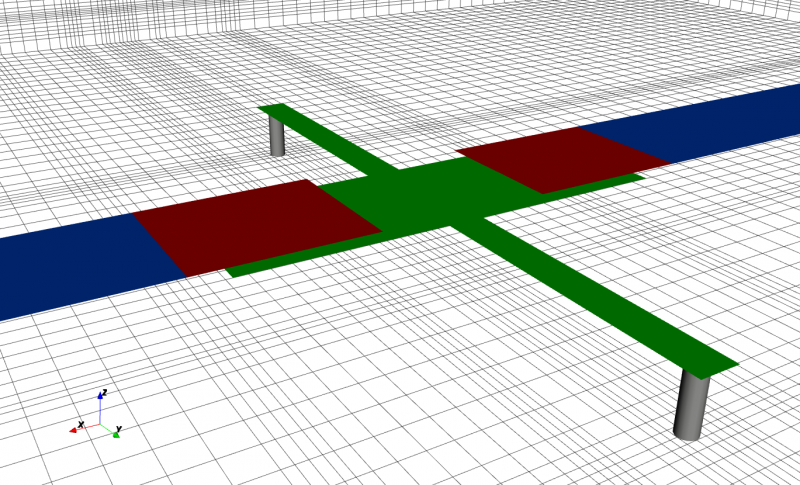

.. _crlh_param_extr_tut:

CRLH Parameter Extraction
==============================

Preface
-----------------------
     
Covered in this tutorial:

* setup a feeding microstrip line & port
* apply an inhomogeneous mesh used for improved accuracy and simulation speed
* use an external script to setup a composite right/left handed (CRLH) unit cell
* use the port voltages and currents to extract the unit cell equivalent circuit parameter

Simulation time: ≈ 3 minutes on a contemporary machine

	
	Setup for the CRLH unit cell parameter extraction

Prerequisites
-----------------------

* make sure you read the :ref:`tutorials primer<tutorials_primer>`

* you may have a look at the :ref:`tutorial introducing a MSL <tut_msl_notch_filter>`

* open the tutorial filea

  * Matlab/Octave: ``CRLH_Extraction.m`` and ``CreateCRLH.m``

  * Python: ``???.py``

Instructions
-----------------------

Setup
^^^^^^^^^^

1. Start the script within an empty environment:

	.. tabs::
		
		.. tab:: Matlab/Octave
			
			.. code-block:: matlab
			  
				close all
				clear
				clc
		
		.. tab:: Python
		
			.. todo::
			
				Python missing

2. Setup the simulation & geometrical parameter

	.. tabs::
		
		.. tab:: Matlab/Octave
			
			.. code-block:: matlab
			  
				physical_constants;
				unit = 1e-6; % specify everything in um
				 
				feed_length = 30000;
				 
				substrate_thickness = [1524 101 254];
				substrate_epsr = [3.48 3.48 3.48];
				 
				CRLH.LL = 14e3;     %CRLH totel (line) length
				CRLH.LW = 4e3;      %CRLH unit cell width (without the stubs)
				CRLH.GLB = 1950;    %CRLH gap width bottom layer
				CRLH.GLT = 4700;    %CRLH gap width top layer
				CRLH.SL = 7800;     %CRLH stub length (bottom layer, both sides)
				CRLH.SW = 1000;     %CRLH stub width  (bottom layer, both sides)
				CRLH.VR = 250;      %CRLH via hole radius (stub -> ground)
				CRLH.TopSig = sum(substrate_thickness);  %top layer height
				CRLH.BottomSig = CRLH.TopSig - substrate_thickness(end);  %bottom layer height
				 
				% frequency range of interest
				f_start = 0.8e9;
				f_stop  = 6e9;
		
		.. tab:: Python
		
			.. todo::
			
				Python missing

3. Setup the FDTD parameter including the excitation time signal and boundary conditions

	.. tabs::
		
		.. tab:: Matlab/Octave
			
			.. code-block:: matlab
			  
				FDTD = InitFDTD('NrTs', 20000 );
				FDTD = SetGaussExcite( FDTD, (f_start+f_stop)/2, (f_stop-f_start)/2 );
				BC   = {'PML_8' 'PML_8' 'MUR' 'MUR' 'PEC' 'PML_8'};
				FDTD = SetBoundaryCond( FDTD, BC );
		
		.. tab:: Python
		
			.. todo::
			
				Python missing

4. Setup the inhomogeneous FDTD mesh and the CRLH unit cell

	.. tabs::
		
		.. tab:: Matlab/Octave
			
			.. code-block:: matlab
			  
				CSX = InitCSX();
				resolution = c0/(f_stop*sqrt(max(substrate_epsr)))/unit /30; % resolution of lambda/30
				 
				mesh.x = [-feed_length-CRLH.LL/2 0 feed_length+CRLH.LL/2];
				mesh.y = [-30000 0 30000];
				substratelines = cumsum(substrate_thickness);
				mesh.z = [0 cumsum(substrate_thickness) linspace(substratelines(end-1),substratelines(end),4) 20000];
				 
				% create the CRLH unit cell (will define additional fixed mesh lines)
				[CSX mesh] = CreateCRLH(CSX, mesh, CRLH, resolution/4);
				 
				% Smooth the given mesh
				mesh.x = SmoothMeshLines(mesh.x, resolution, 1.5, 0);
				mesh.y = SmoothMeshLines(mesh.y, resolution, 1.5, 0);
				mesh.z = SmoothMeshLines(mesh.z, resolution, 1.5, 0);
				CSX = DefineRectGrid( CSX, unit, mesh );
		
		.. tab:: Python
		
			.. todo::
			
				Python missing

5. A closer look inside the CreateCRLH function:

	This function will add all the necessary metal objects composing a CRLH unit cell. Additionally it will add appropriate mesh lines as needed for a smooth mesh including a thin metal handling.

	.. tabs::
		
		.. tab:: Matlab/Octave
			
			.. code-block:: matlab
			  
				function [CSX mesh] = CreateCRLH(CSX, mesh, CRLH, resolution, translate)
				 
				if (nargin<5)
					translate = [0 0 0];
				end
				 
				CSX = AddMetal(CSX, 'metal_top');
				one_two_third = [-resolution/3 2*resolution/3];
				 
				start = [-CRLH.LL/2 -CRLH.LW/2 CRLH.TopSig]+translate;
				stop  = [-CRLH.GLT/2  CRLH.LW/2 CRLH.TopSig]+translate;
				CSX = AddBox(CSX, 'metal_top', 10, start, stop);
				mesh.x = [mesh.x start(1) stop(1)+one_two_third];
				mesh.y = [mesh.y start(2)-one_two_third stop(2)+one_two_third];
				 
				start = [+CRLH.LL/2  -CRLH.LW/2 CRLH.TopSig]+translate;
				stop  = [+CRLH.GLT/2  CRLH.LW/2 CRLH.TopSig]+translate;
				CSX = AddBox(CSX, 'metal_top', 10, start, stop);
				mesh.x = [mesh.x start(1) stop(1)-one_two_third];
				 
				CSX = AddMetal(CSX, 'metal_bot');
				start = [-(CRLH.LL-CRLH.GLB)/2 -CRLH.LW/2 CRLH.BottomSig]+translate;
				stop  = [+(CRLH.LL-CRLH.GLB)/2  CRLH.LW/2 CRLH.BottomSig]+translate;
				CSX = AddBox(CSX, 'metal_bot', 10, start, stop);
				mesh.x = [mesh.x start(1)-one_two_third stop(1)+one_two_third];
				 
				start = [-CRLH.SW/2 -CRLH.LW/2-CRLH.SL CRLH.BottomSig]+translate;
				stop  = [+CRLH.SW/2  CRLH.LW/2+CRLH.SL CRLH.BottomSig]+translate;
				CSX = AddBox(CSX, 'metal_bot', 10, start, stop);
				mesh.x = [mesh.x start(1)-one_two_third stop(1)+one_two_third];
				mesh.y = [mesh.y start(2) stop(2)];
				 
				CSX = AddMetal(CSX, 'via');
				start = [0 -CRLH.LW/2-CRLH.SL+CRLH.SW/2 0]+translate;
				stop  = [0 -CRLH.LW/2-CRLH.SL+CRLH.SW/2 CRLH.BottomSig]+translate;
				CSX = AddCylinder(CSX, 'via', 10, start, stop, CRLH.VR);
				mesh.x = [mesh.x start(1)+[-1 0 1]*CRLH.VR];
				mesh.y = [mesh.y start(2)+[-1 0 1]*CRLH.VR];
				 
				start(2) = -start(2);
				stop(2)  = -stop(2);
				CSX = AddCylinder(CSX, 'via', 10, start, stop, CRLH.VR);
				mesh.y = [mesh.y start(2)+[-1 0 1]*CRLH.VR];
				end
		
		.. tab:: Python
		
			.. todo::
			
				Python missing

6. Add the subtrate layer:

	.. tabs::
		
		.. tab:: Matlab/Octave
			
			.. code-block:: matlab
			  
				substratelines = [0 substratelines];
				for n=1:numel(substrate_thickness)
					CSX = AddMaterial( CSX, ['substrate' int2str(n)] );
					CSX = SetMaterialProperty( CSX, ['substrate' int2str(n)], 'Epsilon', substrate_epsr(n) );
					start = [mesh.x(1),   mesh.y(1),   substratelines(n)];
					stop  = [mesh.x(end), mesh.y(end), substratelines(n+1)];
					CSX = AddBox( CSX, ['substrate' int2str(n)], 0, start, stop );
				end
		
		.. tab:: Python
		
			.. todo::
			
				Python missing

7. Add the two feeding MSL ports

	.. tabs::
		
		.. tab:: Matlab/Octave
			
			.. code-block:: matlab
			  
				CSX = AddMetal( CSX, 'PEC' );
				portstart = [ mesh.x(1) , -CRLH.LW/2, substratelines(end)];
				portstop  = [ -CRLH.LL/2,  CRLH.LW/2, 0];
				[CSX,port{1}] = AddMSLPort( CSX, 999, 1, 'PEC', portstart, portstop, 0, [0 0 -1], 'ExcitePort', 'excite', 'FeedShift', 10*resolution(1), 'MeasPlaneShift',  feed_length/2);
				 
				portstart = [ mesh.x(end) , -CRLH.LW/2, substratelines(end)];
				portstop  = [ +CRLH.LL/2,   CRLH.LW/2, 0];
				[CSX,port{2}] = AddMSLPort( CSX, 999, 2, 'PEC', portstart, portstop, 0, [0 0 -1], 'MeasPlaneShift',  feed_length/2 );
		
		.. tab:: Python
		
			.. todo::
			
				Python missing

   
   8.Create the simulation folder, write the XML file, view the file using AppCSXCAD, and finally run openEMS

	.. tabs::
		
		.. tab:: Matlab/Octave
			
			.. code-block:: matlab
			  
				Sim_Path = 'tmp';
				Sim_CSX = 'CRLH.xml';
				 
				[status, message, messageid] = rmdir( Sim_Path, 's' ); % clear previous directory
				[status, message, messageid] = mkdir( Sim_Path ); % create empty simulation folder
				 
				WriteOpenEMS( [Sim_Path '/' Sim_CSX], FDTD, CSX );
				CSXGeomPlot( [Sim_Path '/' Sim_CSX] );
				RunOpenEMS( Sim_Path, Sim_CSX );
		
		.. tab:: Python
		
			.. todo::
			
				Python missing

Post-Processing
^^^^^^^^^^^^^^^^^^^^^

9. Read the port voltages & currents and calculate the port characteristics

	.. tabs::
		
		.. tab:: Matlab/Octave
			
			.. code-block:: matlab
			  
				close all
				f = linspace( f_start, f_stop, 1601 );
				port = calcPort( port{1}, Sim_Path, f, 'RefPlaneShift', feed_length*unit);
				 
				s11 = port{1}.uf.ref./ port{1}.uf.inc;
				s21 = port{2}.uf.ref./ port{1}.uf.inc;
				 
				plot(f/1e9,20*log10(abs(s11)),'k-','LineWidth',2);
				hold on;
				grid on;
				plot(f/1e9,20*log10(abs(s21)),'r--','LineWidth',2);
				l = legend('S_{11}','S_{21}','Location','Best');
				set(l,'FontSize',12);
				ylabel('S-Parameter (dB)','FontSize',12);
				xlabel('frequency (GHz) \rightarrow','FontSize',12);
				ylim([-40 2]);
		
		.. tab:: Python
		
			.. todo::
			
				Python missing
	
	.. figure:: images/CRLH_Extract_SPara.png
		:alt: CRLH unit cell S-Parameter
		:align: center
		:scale: 67%
		
		CRLH unit cell S-Parameter

10. Extract the unit cell parameter:

	You may have a look at `this paper on CRLH parameter extraction details <https://www.ate.uni-duisburg.de/data/dokumente_2010/METAMATERIALS_2010_Liebig.pdf>`_.
	
	.. todo::
		
		Link is dead

	.. tabs::
		
		.. tab:: Matlab/Octave
			
			.. code-block:: matlab
			  
				A = ((1+s11).*(1-s11) + s21.*s21)./(2*s21);
				C = ((1-s11).*(1-s11) - s21.*s21)./(2*s21) ./ port{1}.ZL;
				 
				Y = C;
				Z = 2*(A-1)./C;
				 
				iZ = imag(Z);
				iY = imag(Y);
				 
				fse = interp1(iZ,f,0);
				fsh = interp1(iY,f,0);
				 
				df = f(2)-f(1);
				fse_idx = find(f>fse,1);
				fsh_idx = find(f>fsh,1);
				 
				LR = 0.5*(iZ(fse_idx)-iZ(fse_idx-1))./(2*pi*df);
				CL = 1/(2*pi*fse)^2/LR;
				 
				CR = 0.5*(iY(fsh_idx)-iY(fsh_idx-1))./(2*pi*df);
				LL = 1/(2*pi*fsh)^2/CR;
				 
				disp([' Series tank: CL = ' num2str(CL*1e12,3) 'pF;  LR = ' num2str(LR*1e9,3) 'nH -> f_se = ' num2str(fse*1e-9,3) 'GHz ']);
				disp([' Shunt  tank: CR = ' num2str(CR*1e12,3) 'pF;  LL = ' num2str(LL*1e9,3) 'nH -> f_sh = ' num2str(fsh*1e-9,3) 'GHz ']);
		
		.. tab:: Python
		
			.. todo::
			
				Python missing

11. Calculate and display the dispersion diagram:

	.. figure:: images/CRLH_Extract_DispDia.png
		:alt: CRLH unit cell dispersion diagram
		:align: center
		:scale: 67%
		
		CRLH unit cell dispersion diagram
