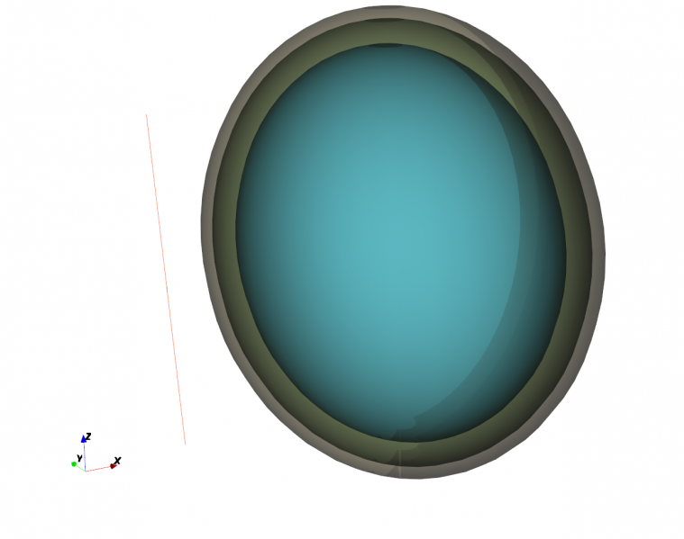
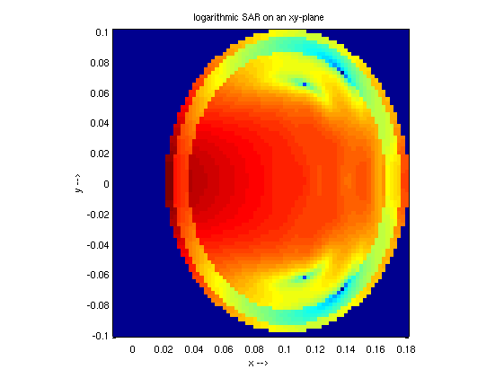
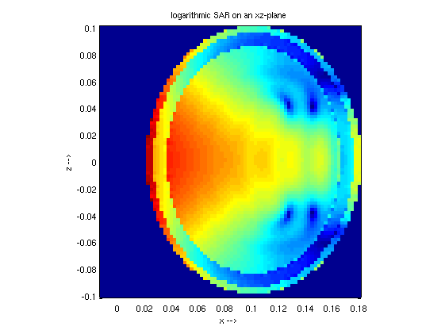

Dipole SAR
==============================

Preface
-----------------------
     
Covered in this tutorial:

* Setup of a simple dipole antenna
* Setup of stacked human head phantom
* Adding a specific absorption rate (SAR) dump box
* Adding a near-field to far-field (nf2ff) box to use for power budget evaluation
* Calculate the S-Parameter and input-impedance of the antenna
* Calculate and plot the SAR distribution

Prerequisites
-----------------------

* make sure you read the :ref:`tutorials primer<tutorials_primer>`

* recommended: some experience with openEMS, e.g. by walking through earlier :ref:`tutorials <tutorials>`

* open the tutorial file

  * Matlab/Octave: ``Dipole_SAR.m``

  * Python: ``???.py``

Instructions
-----------------------

This tutorial does not have detailed instructions. Open the tutorial file in Matlab/Octave or Python, and run it.

	
	Dipole and stacked head phantom setup

Results
-----------------------

	
	Logarithmic SAR distribution on a XY-plane

	
	Logarithmic SAR distribution on a XZ-plane
