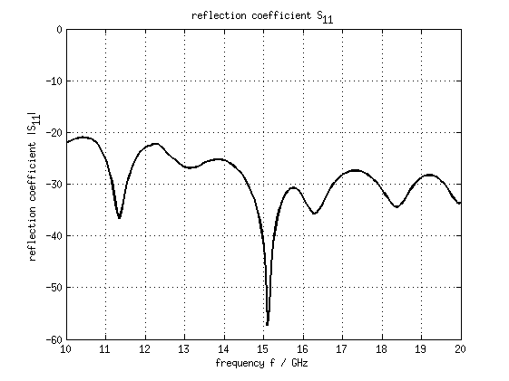
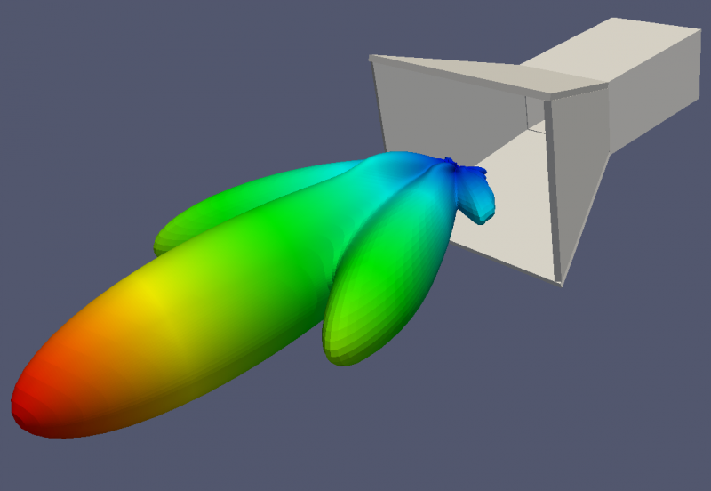

Horn Antenna
==============================

Preface
-----------------------
     
Covered in this tutorial:

* Setup horn antenna using transformated linear extruded polygons
* Setup a rectangular feeding port
* Adding a near-field to far-field (nf2ff) box
* Calculate the S-Parameter of the antenna
* Calculate and plot the far-field pattern

Simulation time: ≈ 10 minutes on a contemporary machine, plus ≈ 1 hour for the far field

Prerequisites
-----------------------

* make sure you read the :ref:`tutorials primer<tutorials_primer>`

* recommended: some experience with openEMS, e.g. by walking through earlier :ref:`tutorials <tutorials>`

* open the tutorial file

  * Matlab/Octave: ``Horn_Antenna.m``

  * Python: ``???.py``

.. todo::

	Python missing

Instructions
-----------------------

This tutorial does not have detailed instructions. Open the tutorial file in Matlab/Octave or Python, and run it.

Results
-----------------------

	
	Antenna return loss
	

	
	Antenna structure and radiation pattern
