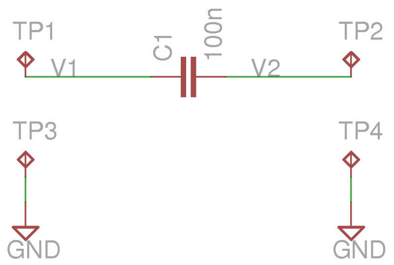
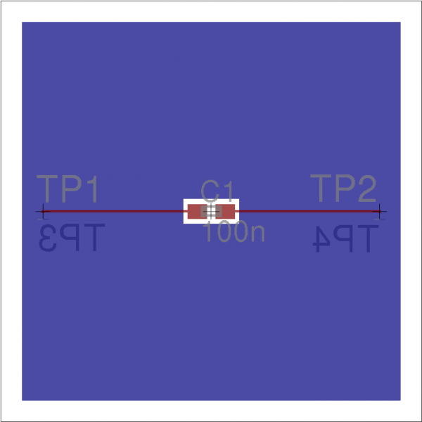
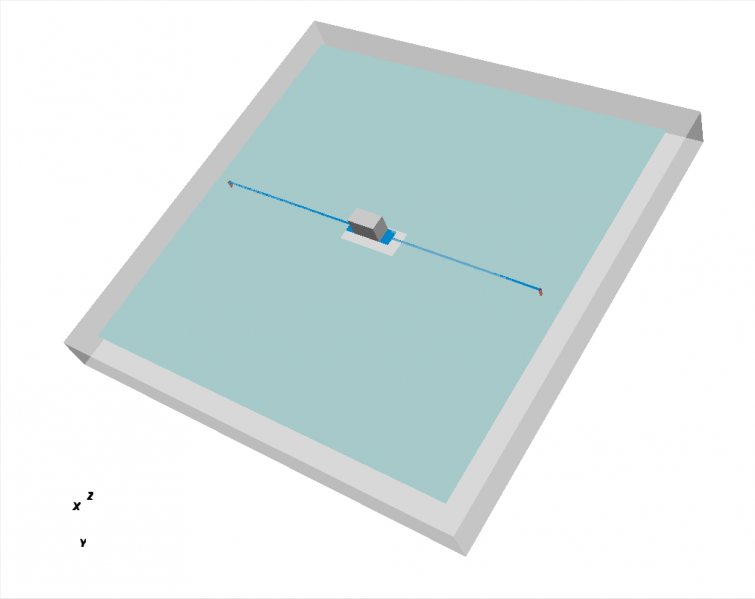
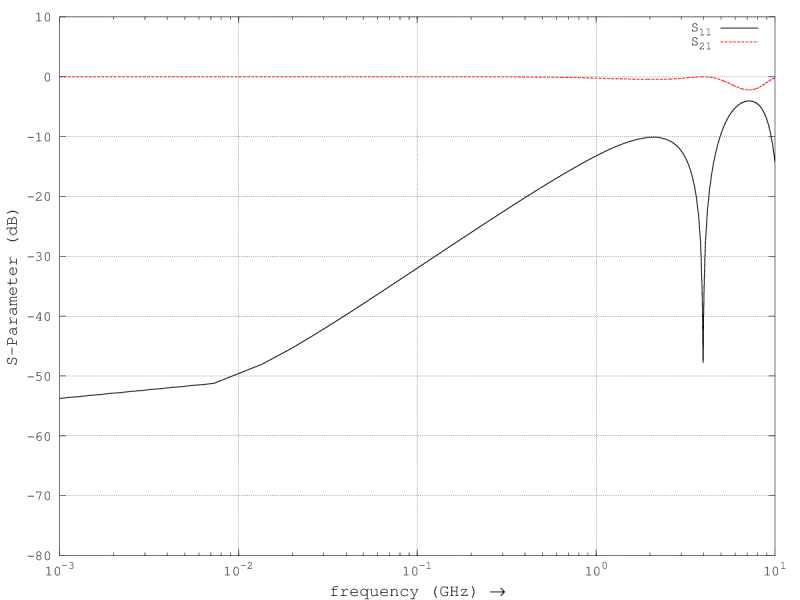

.. _tut_hyp2mat:

Importing with hyp2mat
==============================

Preface
-----------------------
     
Covered in this tutorial:

* Exporting to HyperLynx
* Importing in openEMS
* Adding a component
* Adding excitation and load
* Setting boundary conditions
* Setting up a mesh
* Simulation
* Calculating the s-parameters
* Calculating the step response

Prerequisites
-----------------------

* make sure you read the :ref:`tutorials primer<tutorials_primer>`

Introduction
-----------------------

*hyp2mat* is a package which allows you to import PCBs from your CAD system to *openEMS* for simulation. A *HyperLynx* file contains all information needed for simulating the board: board layout, netlists, component values, component placement, board dielectric constant, copper thickness and resistance.

To use *hyp2mat*, your CAD system has to be able to export in *HyperLynx* format. A number of CAD system export *HyperLynx*, e.g. *Altium Designer*, *Expedition*, *PADS*, *CADsoft Eagle*.

In this tutorial the freeware version of Eagle is used.

As an example, we'll use a practical problem in pcb design: a capacitor in a microstrip line.

A microstrip line is used to connect a transmitter and a receiver. A capacitor is placed in the microstrip line to provide ac coupling between transmitter and receiver. Unfortunately, the capacitance between capacitor solder pads and the ground plane causes a mismatch between capacitor and microstrip. A common solution is partially removing the ground plane below the capacitor. This lowers the capacitance of the solder pads to the ground plane. A trial-and-error method is used to determine the size of the hole in the ground plane for a good match between capacitor and microstrip [UG293]_.

We'll now create a printed circuit board with a microstrip line and a capacitor, and then simulate the board using openEMS. If you are running Windows, the tutorial can be found at openems\hyp2mat\eagle\tutorial. If you are running linux and have installed the hyp2mat-demo package, tutorial files are at /usr/share/hyp2mat/eagle/tutorial. Files for the tutorial can also be downloaded from github. Copy tutorial files to a directory where you have read/write access before running.

.. todo::
	 
	 Can we move this to tutorials/?

Exporting to Hyperlynx
----------------------------

	
	Schematic of microstrip and capacitor
	

	
	Board with microstrip and capacitor

This shows schematic and board of our test setup. The schematic is simple: a 100n capacitor between two test pads. An excitation, e.g. a signal generator, is connected between TP1 and TP3. A load, e.g. a 50R resistor, is connected between TP2 and TP4. The board has a ground plane and a signal layer. The ground plane is shown in blue. There ground plane has a cutout in the center, where an SMD capacitor is placed. A microstrip runs from TP1 to capacitor and from capacitor to TP2. At the back of the board there are two test points, TP3 and TP4, which connect to the ground plane.

When drawing the board, it is important to design the board for simulation:

* Avoid unnecessary 'small' features
	* Small features mean long simulation times

* In general, only a few nets of interest are simulated, not the whole board
	* When importing in openEMS, the net names are used to select the signals of interest
	* Make sure all wires and polygons which you wish to simulate have been assigned to a net
	* Give all nets which you want to simulate a name

* During simulation, we will place excitation and load at component pins
	* Add test points if necessary

.. warning::

	At this moment, the following limitatations apply:

	* polygon edges are always drawn with zero width
	* polygons should not be self-intersecting

When using **CADsoft Eagle**:

    Before exporting a board to HyperLynx in Eagle, make sure you have downloaded the latest version of the `hyperlynx.ulp script <https://forums.autodesk.com/t5/eagle-forum/hyperlynx-export/m-p/7254537>`_.
    
    To export to HyperLynx, switch to the Eagle board editor, and type:

	::
	
		ratsnest
		run hyperlynx

    The resulting HyperLynx file has the .hyp suffix.
    
    At this moment, the Eagle script which exports Hyperlynx has hardcoded values for copper thickness, dielectric thickness, and dielectric constant. Changing these values requires modifying either the Eagle script or the exported file. This is a deficiency. Other CAD systems use actual board values.

This tutorial includes a ready-to-run Hyperlynx file, ``msl.hyp``. Including a HyperLynx file allows for a stand-alone tutorial. If you're interested how copper and dielectric thickness were changed for this tutorial, look at msl.patch.

.. todo::
	
	What is msl.patch? Where is that?

Running openEMS
-----------------------------

1. Prepare your environment:

	.. tabs::
		
		.. tab:: Matlab/Octave
			
			.. code-block:: matlab
			  
				close all
				clear
				clc
		
		.. tab:: Python
		
			.. todo::
			
				Python missing

2. Load physical constants (speed of light, permittivity of vacuum) and set the maximum frequency we're interested in.

	.. tabs::
		
		.. tab:: Matlab/Octave
			
			.. code-block:: matlab
			  
				physical_constants;
				f_max = 7e9;
		
		.. tab:: Python
		
			.. todo::
			
				Python missing

We now proceed to build two structures:

*  CSX, a 3D model of the pcb we wish to simulate
*  FDTD, the finite-difference time-domain simulation

We begin with building the 3D model.

Importing a printed circuit board
----------------------------------------------

3. To import the PCB to openEMS, type:

	.. tabs::
		
		.. tab:: Matlab/Octave
			
			.. code-block:: matlab
			  
				CSX = InitCSX();
				CSX = ImportHyperLynx(CSX, 'msl.HYP');
		
		.. tab:: Python
		
			.. todo::
			
				Python missing

If an error message states 'InitCSX' or 'ImportHyperLynx' is undefined, you need to have another look at the install instructions

.. todo::
	
	Do I have to prepare Matlab/Octave/Python separately for HyperLynx?

Alternatively, you may choose to import only a few nets:

	.. tabs::
		
		.. tab:: Matlab/Octave
			
			.. code-block:: matlab
			  
				CSX = InitCSX();
				CSX = ImportHyperLynx(CSX, 'msl.HYP', {'GND' 'V1'});
		
		.. tab:: Python
		
			.. todo::
			
				Python missing

	This imports only nets GND and V1.

Terminal output of openEMS is copper thickness, :math:`\epsilon_r`, and board size.

::

	loading msl.HYP
	copper: Top = 35.56 um
	copper: Bottom = 35.56 um
	epsilonr = 4.8
	board: x = 0 : 20 mm
		   y = 0 : 20 mm
		   z = 0 : 1.8717 mm

You should verify the values are plausible for your board. In the above, 36 µm is approximately 1 ounce of copper per square foot.

Adding a component
-----------------------------

4. We want to add a capacitor to our board. The GetHyperLynxPort function provides the coordinates of component pins and pads. To obtain a list of available pads, type:

	.. tabs::
		
		.. tab:: Matlab/Octave
			
			.. code-block:: matlab
			  
				GetHyperLynxPort(CSX, '');
		
		.. tab:: Python
		
			.. todo::
			
				Python missing

	The capacitor pads are called ``C1.1`` and ``C1.2``.

5. First we obtain the coordinates of the capacitor solder pads:

	.. tabs::
		
		.. tab:: Matlab/Octave
			
			.. code-block:: matlab
			  
				[pad1_material, pad1_start, pad1_stop] = GetHyperLynxPort(CSX, 'C1.1');
				[pad2_material, pad2_start, pad2_stop] = GetHyperLynxPort(CSX, 'C1.2');
		
		.. tab:: Python
		
			.. todo::
			
				Python missing

6. Calculate two opposing corners of the capacitor, c1_start and c1_stop. The capacitor begins and ends in the middle of a solder pad:

	.. tabs::
		
		.. tab:: Matlab/Octave
			
			.. code-block:: matlab
			  
				c1_height = pad1_stop - pad1_start;
				c1_start = [(pad1_start(1)+pad1_stop(1))/2, pad1_start(2), pad1_start(3)];
				c1_stop  = [(pad2_start(1)+pad2_stop(1))/2, pad2_stop(2), pad2_stop(3)+c1_height];
		
		.. tab:: Python
		
			.. todo::
			
				Python missing

7. Create a 100 nF capacitor:

	.. tabs::
		
		.. tab:: Matlab/Octave
			
			.. code-block:: matlab
			  
				CSX = AddLumpedElement( CSX, 'Capacitor', 0, 'Caps', 1, 'C', 100e-9);
				CSX = AddBox( CSX, 'Capacitor', 0, c1_start, c1_stop );
		
		.. tab:: Python
		
			.. todo::
			
				Python missing

Adding excitation and load
---------------------------------

8. Obtain the coordinates of the test pads where excitation and load are applied:

	.. tabs::
		
		.. tab:: Matlab/Octave
			
			.. code-block:: matlab
			  
				[port1_material, port1_start, port1_stop] = GetHyperLynxPort(CSX, 'TP1.TP');
				[gnd1_material, gnd1_start, gnd1_stop]    = GetHyperLynxPort(CSX, 'TP3.TP');
				[port2_material, port2_start, port2_stop] = GetHyperLynxPort(CSX, 'TP2.TP');
				[gnd2_material, gnd2_start, gnd2_stop]    = GetHyperLynxPort(CSX, 'TP4.TP');
		
		.. tab:: Python
		
			.. todo::
			
				Python missing

9. Add an excitation between input test pad and ground:

	.. tabs::
		
		.. tab:: Matlab/Octave
			
			.. code-block:: matlab
			  
				[CSX, port{1}] = AddLumpedPort( CSX, 999, 1, 50, gnd1_start, port1_stop, [0 0 -1], true);
		
		.. tab:: Python
		
			.. todo::
			
				Python missing

10. Add a load between output test pad and ground:

	.. tabs::
		
		.. tab:: Matlab/Octave
			
			.. code-block:: matlab
			  
				[CSX, port{2}] = AddLumpedPort( CSX, 999, 2, 50, gnd2_start, port2_stop, [0 0 -1]);
		
		.. tab:: Python
		
			.. todo::
			
				Python missing

Setting up a mesh
----------------------------------

11. Calculate mesh size in pcb and in air as a fraction of λ. GetUnits() and GetEpsilon() extract scale factor and epsilon r from the model ImportHyperLynx() built.

	.. tabs::
		
		.. tab:: Matlab/Octave
			
			.. code-block:: matlab
			  
				unit = GetUnits(CSX);
				substrate_epr = GetEpsilon(CSX);
				resolution = c0 / f_max / sqrt(substrate_epr) / unit / 25;
				AirBox = c0 / f_max / unit / 25;
		
		.. tab:: Python
		
			.. todo::
			
				Python missing

12. A mesh can be specified manually, created automatically from the model, or both. As an example, we create the mesh from the 3D model and specify an additional mesh line through the middle of the board:

	.. tabs::
		
		.. tab:: Matlab/Octave
			
			.. code-block:: matlab
			  
				z_top = port1_start(3);
				z_bottom = gnd1_start(3);
				z_middle = (z_top+z_bottom)/2;
				 
				mesh.x = [];
				mesh.y = [];
				mesh.z = [ z_middle ];
		
		.. tab:: Python
		
			.. todo::
			
				Python missing

13. Add the edges of our 3D model to the mesh:

	.. tabs::
		
		.. tab:: Matlab/Octave
			
			.. code-block:: matlab
			  
				mesh = DetectEdges(CSX, mesh);
		
		.. tab:: Python
		
			.. todo::
			
				Python missing

14. Next, we create an air-box around the imported structure:

	.. tabs::
		
		.. tab:: Matlab/Octave
			
			.. code-block:: matlab
			  
				mesh.x = [min(mesh.x)-AirBox max(mesh.x)+AirBox mesh.x];
				mesh.y = [min(mesh.y)-AirBox max(mesh.y)+AirBox mesh.y];
				mesh.z = [min(mesh.z)-AirBox max(mesh.z)+2*AirBox mesh.z];
		
		.. tab:: Python
		
			.. todo::
			
				Python missing

15 .Finally, the mesh is smoothened:

	.. tabs::
		
		.. tab:: Matlab/Octave
			
			.. code-block:: matlab
			  
				mesh = SmoothMesh(mesh, resolution);
		
		.. tab:: Python
		
			.. todo::
			
				Python missing

Setting boundary conditions
--------------------------------------

16. Create the FDTD simulation. The excitation is a Gaussian pulse:

	.. tabs::
		
		.. tab:: Matlab/Octave
			
			.. code-block:: matlab
			  
				FDTD = InitFDTD();
				FDTD = SetGaussExcite(FDTD, f_max/2, f_max/2);
		
		.. tab:: Python
		
			.. todo::
			
				Python missing

17. A Perfectly Matched Layer (PML) is placed around our model. A Perfectly Matched Layer a material which absorbs incident fields.

	.. tabs::
		
		.. tab:: Matlab/Octave
			
			.. code-block:: matlab
			  
				BC   = {'PML_8' 'PML_8' 'PML_8' 'PML_8' 'PML_8' 'PML_8'};
				FDTD = SetBoundaryCond(FDTD, BC );
		
		.. tab:: Python
		
			.. todo::
			
				Python missing

18. This Perfectly Matched Layer is 8 cells deep. We need to add 8 cells to the mesh to make room for the PML:

	.. tabs::
		
		.. tab:: Matlab/Octave
			
			.. code-block:: matlab
			  
				mesh = AddPML(mesh, 8);
		
		.. tab:: Python
		
			.. todo::
			
				Python missing

19. The finished mesh is now written to our model:

	.. tabs::
		
		.. tab:: Matlab/Octave
			
			.. code-block:: matlab
			  
				CSX = DefineRectGrid(CSX, unit, mesh);
		
		.. tab:: Python
		
			.. todo::
			
				Python missing

This completes the model. Simulation is next.

Simulation
-------------------------------

We write the model to disk, display the model and run the simulation.

Write to Disk
^^^^^^^^^^^^^^^^^^^^^^

20. First clean up the directory where we will run the simulation:

	.. tabs::
		
		.. tab:: Matlab/Octave
			
			.. code-block:: matlab
			  
				Sim_Path = 'tmp';
				Sim_CSX = 'msl.xml';
				 
				[status, message, messageid] = rmdir(Sim_Path, 's'); % clear previous directory
				[status, message, messageid] = mkdir(Sim_Path ); % create empty simulation folder

				Write CSX 3D model and FDTD simulation parameters to disk

				WriteOpenEMS([Sim_Path '/' Sim_CSX], FDTD, CSX);
		
		.. tab:: Python
		
			.. todo::
			
				Python missing

Display the 3D model
^^^^^^^^^^^^^^^^^^^^^^

	
	3D CSX model; the gray box in the center is the SMD capacitor

21. Display the 3D model and verify its correctness.

	.. tabs::
		
		.. tab:: Matlab/Octave
			
			.. code-block:: matlab
			  
				CSXGeomPlot([Sim_Path '/' Sim_CSX]);
		
		.. tab:: Python
		
			.. todo::
			
				Python missing

A small word about error messages.

.. todo::
	
	Does this belong here? It clearly is unrelated to the viewer... can we just move that to the end, where all the other error messages are discussed?

``ImportHyperLynx`` creates two materials for every layer: one for the copper and one for holes in the copper. A layer "Top" will have associated two materials:

* "Top_copper" for copper traces
* "Top_cutout" for holes in polygons

An error message "*No primitives found in property: Top_cutout*" means layer "Top" has no copper polygons with holes. Similarly, "*No primitives found in property: via*" means the board has no vias.

Now is a good moment to take a look at the generated mesh. You may want to switch to 2D view to see whether mesh and edges coincide.

In general, mesh lines which are close together mean a long simulation time. Several strategies are available to reduce the mesh:

* Change the geometry of your design so edges coincide
* Change the geometry of your design so edges are further apart
* Change the algorithm SmoothMesh uses, e.g.

	.. tabs::
		
		.. tab:: Matlab/Octave
			
			.. code-block:: matlab
			  
				mesh = SmoothMesh(mesh, resolution, 'algorithm', [ 1 ]);
		
		.. tab:: Python
		
			.. todo::
			
				Python missing

Trial and error may be needed to select the optimal set of algorithms.

Run the simulation
^^^^^^^^^^^^^^^^^^^^^^

22. Run the openEMS simulation:

	.. tabs::
		
		.. tab:: Matlab/Octave
			
			.. code-block:: matlab
			  
				RunOpenEMS(Sim_Path, Sim_CSX);
		
		.. tab:: Python
		
			.. todo::
			
				Python missing

Calculating the s-parameters
----------------------------------------

23. Calculate voltage and currents at the input and output ports.

	.. tabs::
		
		.. tab:: Matlab/Octave
			
			.. code-block:: matlab
			  
				close all
				f = linspace( 1e6, f_max, 1601 );
				port = calcPort( port, Sim_Path, f, 'RefImpedance', 50);
		
		.. tab:: Python
		
			.. todo::
			
				Python missing

24. Calculate S11 and S21 as reflected voltage divided by incoming voltage.

	.. tabs::
		
		.. tab:: Matlab/Octave
			
			.. code-block:: matlab
			  
				s11 = port{1}.uf.ref./ port{1}.uf.inc;
				s21 = port{2}.uf.ref./ port{1}.uf.inc;
		
		.. tab:: Python
		
			.. todo::
			
				Python missing

25. Plot a graph of S11 and S21

	.. tabs::
		
		.. tab:: Matlab/Octave
			
			.. code-block:: matlab
			  
				semilogx(f/1e9,20*log10(abs(s11)),'k-','LineWidth',2);
				hold on;
				grid on;
				semilogx(f/1e9,20*log10(abs(s21)),'r--','LineWidth',2);
				legend('S_{11}','S_{21}');
				ylabel('S-Parameter (dB)','FontSize',12);
				xlabel('frequency (GHz) \rightarrow','FontSize',12);
				ylim([-80 10]);
				print('sparam.png', '-dpng');
		
		.. tab:: Python
		
			.. todo::
			
				Python missing

	
	S-Parameters

Obviously the frequency response of this board can be improved.

Calculating the step response
--------------------------------------

Calculate the step response from the s-parameters. This still needs to be done. `See here <https://hig.diva-portal.org/smash/get/diva2:356588/FULLTEXT01>`_ for a possible approach.

Error messages
-------------------------

If an error occurs while scanning or parsing the HyperLynx file, an error message is printed, and scanning or parsing continues with the next HyperLynx record or subrecord, if any. Of course, it is always prudent to check the cause of an error message. Usually, a trivial edit of the HyperLynx file will suppress the error message. Two common causes of errors are unquoted strings, and unassigned component values. We'll look at these two errors in detail, should you encounter them in your projects.

Unquoted strings
^^^^^^^^^^^^^^^^^^^^^^^^

Sample error message:

	::

		syntax error, unexpected STRING at 'Logo'

Sample corresponding line in the .hyp-file:

	::

		(? REF=Altium Logo BOT1 L=Bottom_Layer)

An unquoted string contains a space (``' '``). This is an error in the program which created the .hyp-file. To solve this, edit the .hyp-file and put the string between double quotes:

	::

		(? REF="Altium Logo BOT1" L=Bottom_Layer)

Unassigned component values
^^^^^^^^^^^^^^^^^^^^^^^^^^^^^^^^^

Sample error message:

	::
	
		syntax error, unexpected L, expecting FLOAT or STRING at 'L'

Sample corresponding line in the .hyp-file:

	::
	
		(L REF="L1" VAL= L="Top")

Coil L1 on layer "Top" has not been assigned a value (``VAL =``). To solve this, edit the .hyp-file and assign a value to the component:

	::
	
		(L REF="L1" VAL=0 L="Top")

or assign the coil a value in the schematics editor and re-export to HyperLynx.

References
-------------------

.. [UG293] Xilinx UG293
	Spartan-6 FPGA PCB Design and Pin Planning Guide, p. 50: Design of Transitions for High-Speed Signals

.. todo::
	
	Some links are given directly, this one as a reference. Make a common scheme?
