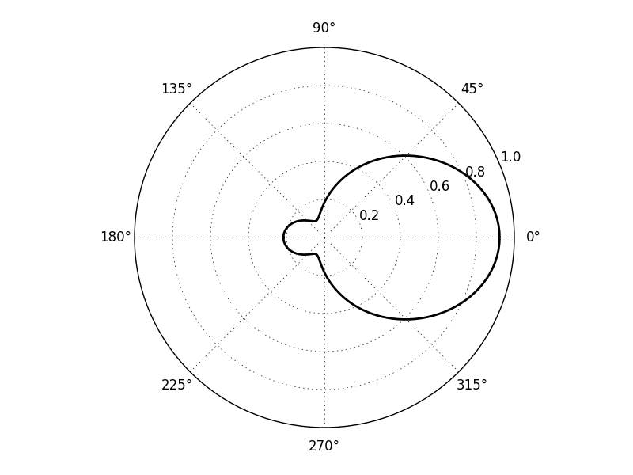
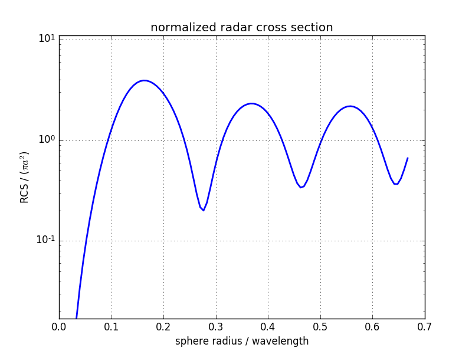

Metal Sphere Radar Cross Section
===========================================

Preface
-----------------------
     
Covered in this tutorial:

* The total-field/scattered-field approach
* Calculation of a radar cross section (RCS)

Simulation time: ≈ 1 minute on a contemporary machine

Prerequisites
-----------------------

* make sure you read the :ref:`tutorials primer<tutorials_primer>`

* open the tutorial file

  * Matlab/Octave: ``RCS_Sphere.m``

  * Python: ``RCS_Sphere.py``

Instructions
-----------------------

This tutorial does not have detailed instructions. Open the tutorial file in Matlab/Octave or Python, and run it. It is recommended that you have some experience with openEMS already, e.g. by walking through the :ref:`introductory tutorials <intro_tuts>`.

Results
-------------

    
    Radar cross section pattern

    
    Normalized radar cross Section over normalized wavelength
