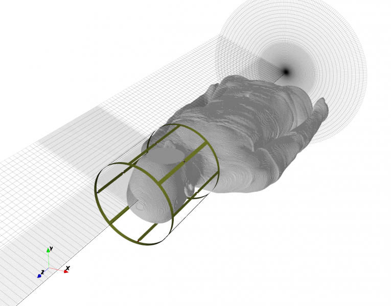
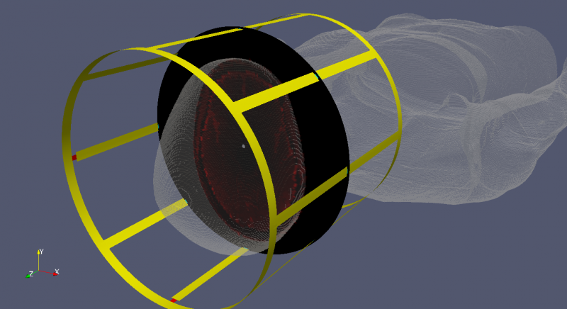
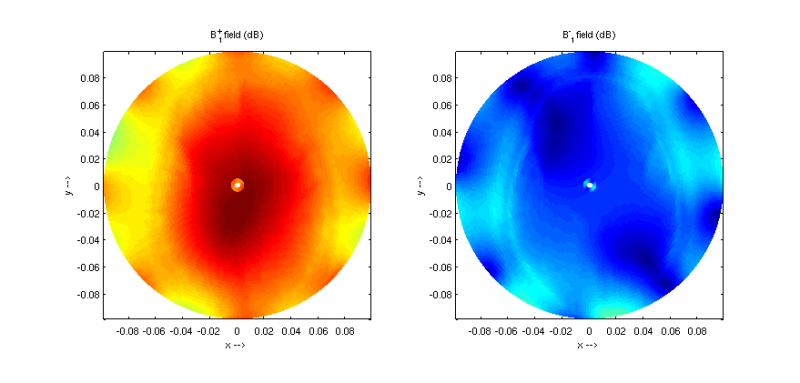
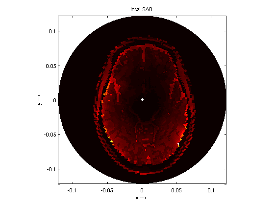

MRI LP Birdcage
==============================

Preface
-----------------------
     
Covered in this tutorial:

* Setup of an 3T MRI low pass birdcage coil (:math:`f_0 = 128 MHz`)
* Setup of a cylindrical FDTD mesh including sub-grids
* Converting and including a Virtual Family Body Model
* Adding a 3D SAR dump box
* Calculate the S-Parameter
* Calculate and plot :math:`B_1^+` and :math:`B_1^-`
* Calculate and plot the SAR distribution

Simulation time: ≈ 7 hours on a contemporary machine (at 65 MC/s)

Prerequisites
-----------------------

* make sure you read the :ref:`tutorials primer<tutorials_primer>`

* recommended: some experience with openEMS, e.g. by walking through earlier :ref:`tutorials <tutorials>`

* the "Virtual Family Model" from `here <https://www.itis.ethz.ch/itis-for-health/virtual-population/overview>`_ (note the alternatives mentioned in the instructions below)

* open the tutorial file

  * Matlab/Octave: ``MRI_LP_Birdcage.m``

  * Python: ``???.py``
  
  .. todo::
	
	Python script missing

Instructions
-----------------------

This tutorial does not have detailed instructions. Open the tutorial file in Matlab/Octave or Python, and run it.

.. note::
	
	If you don't have access to Matlab (to convert the body model once) or have no access to the virtual family body models, you may want to replace the discrete material with a simple phantom model:
	
	.. code-block:: matlab
	
		CSX = AddMaterial(CSX, 'phantom_head');
		CSX = SetMaterialProperty( CSX,'phantom_head', 'Epsilon', 60, 'Kappa', 0.7, 'Density', 1040);
		CSX = AddSphere(CSX, 'phantom_head', 0, [0 0 0], 110,'Transform',{'Scale',[1 0.8 1]} ); 

	.. todo::

		I copypasted this from the other MRI tutorial... I assume it also works here?

	
	MRI low pass birdcage and VF human body model

Results
-----------------------
	

	
	MRI Low Pass BirdCage Coil, VF human body model and SAR plot in Paraview
	

	
	:math:`B_1` field distribution on a XY-plane
	

	
	Local SAR distribution on a XY-plane

Literature
-----------------

Christ A, Kainz W, Hahn E G, Honegger K, Zefferer M, Neufeld E, Rascher W, Janka R, Bautz W, Chen J, Kiefer B, Schmitt P, Hollenbach H P, Shen J X, Oberle M,Szczerba D, Kam A, Guag J and Kuster N: The Virtual Family – Development of surface­based anatomical models of two adults and two children for dosimetric simulations, Phys. Med. Biol. 55 (2010)
