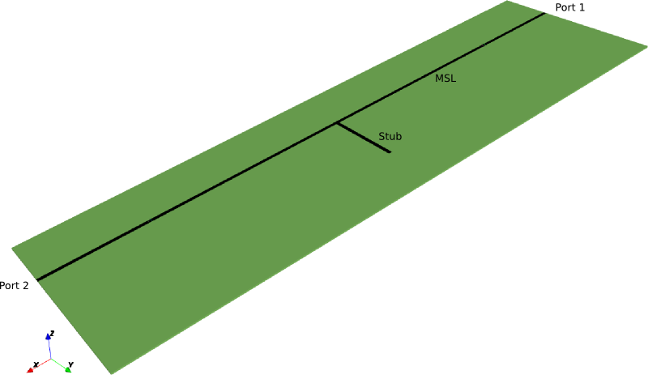
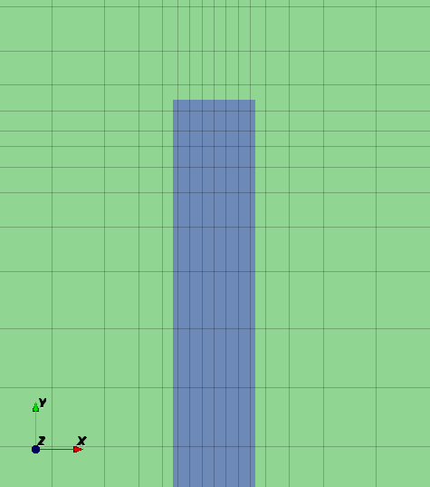
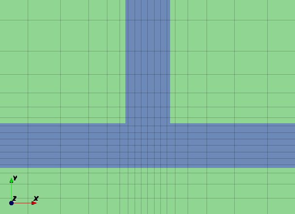
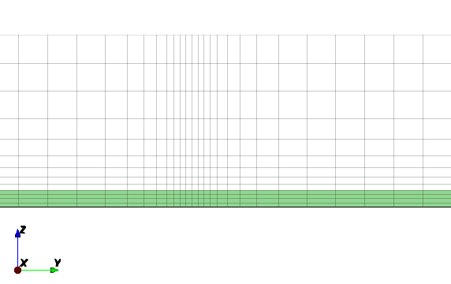
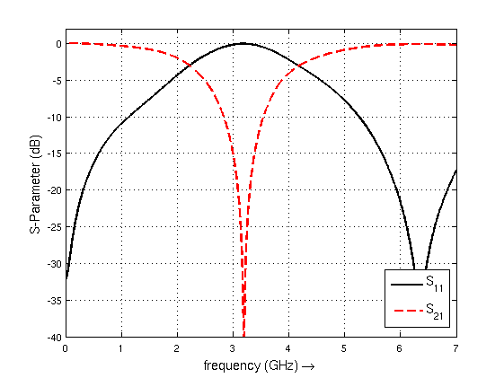

.. _tut_msl_notch_filter:

Microstrip Notch Filter
==============================

Preface
-----------------------
     
Covered in this tutorial:

* Set up a microstrip line (MSL) and MSL port

* Apply an inhomogeneous mesh used for improved accuracy and simulation speed

* Calculate the S-parameters of the filter

Simulation time: ≈ 2 minutes on a contemporary machine

	
	The filter geometry

Prerequisites
-----------------------

* make sure you read the :ref:`tutorials primer<tutorials_primer>`

* open the tutorial file

  * Matlab/Octave: ``MSL_NotchFilter.m``

  * Python: ``msl_notch_filter.py``

Instructions
-----------------------

1. Prepare your environment

	.. tabs::
		
		.. tab:: Matlab/Octave
			
			.. code-block:: matlab
			  
				close all
				clear
				clc
				
				% load C0, MUE0, EPS0, Z0
				physical_constants;
		
		.. tab:: Python
		
			.. code-block:: python
				
				import os, tempfile
				from pylab import *

				from CSXCAD  import ContinuousStructure
				from openEMS import openEMS
				from openEMS.physical_constants import *

.. todo::
	
	I had to tweak the code here, this must be reflected in the .m and .py files in the repo as well!

2. Setup the simulation and geometrical parameters

	.. tabs::
		
		.. tab:: Matlab/Octave
			
			.. code-block:: matlab
			  
				unit = 1e-6; % specify everything in µm
				MSL_length = 50000;
				MSL_width = 600;
				substrate_thickness = 254;
				substrate_epr = 3.66;
				stub_length = 12e3;
				f_max = 7e9;
		
		.. tab:: Python
		
			.. code-block:: python
			
				unit = 1e-6 # specify everything in µm
				MSL_length = 50000
				MSL_width = 600
				substrate_thickness = 254
				substrate_epr = 3.66
				stub_length = 12e3
				f_max = 7e9

3. Setup the FDTD parameter, including the excitation time signal and boundary conditions
	
	The BC on the left and right are PML_8, so that the MSL does not see reflections at the end.
	The BC on the bottom is PEC, which acts as our GND-layer.
	All other BCs are set to MUR.
	
	.. note::
		
		See :ref:`here <boundarycond>` to learn more about boundary conditions.
	
	.. tabs::
		
		.. tab:: Matlab/Octave
			
			.. code-block:: matlab
			  
				FDTD = InitFDTD();
				FDTD = SetGaussExcite( FDTD, f_max/2, f_max/2 );
				BC   = {'PML_8' 'PML_8' 'MUR' 'MUR' 'PEC' 'MUR'};
				FDTD = SetBoundaryCond( FDTD, BC );
		
		.. tab:: Python
		
			.. code-block:: python
			
				FDTD = openEMS()
				FDTD.SetGaussExcite( f_max/2, f_max/2 )
				FDTD.SetBoundaryCond( ['PML_8', 'PML_8', 'MUR', 'MUR', 'PEC', 'MUR'] )

4. Setup the inhomogeneous FDTD mesh

	We will innclude an improved handling of the thin metal edges by using two mesh lines.
	One line is located 1/3 inside, the other one 2/3 outside of the thin metal.
	
	.. note::
		
		See :ref:`meshing <meshing>` to learn more about this technique, and note that there is a :ref:`discussion <msl_notch_tut_mesh_ratio>` about this topic at the end of this tutorial.

	
	.. tabs::
		
		.. tab:: Matlab/Octave
			
			.. code-block:: matlab
			  
				CSX = InitCSX();
				lambda = c0/(f_max*sqrt(substrate_epr))/unit;
				resolution = lambda / 50;
				mesh.x = SmoothMeshLines( [0 MSL_width/2+[resolution/3 -resolution/3*2]/4], resolution/4, 1.5 ,0 );
				mesh.x = SmoothMeshLines( [-MSL_length -mesh.x mesh.x MSL_length], resolution, 1.5 ,0 );
				mesh.y = SmoothMeshLines( [0 MSL_width/2+[-resolution/3 +resolution/3*2]/4], resolution/4 , 1.5 ,0);
				mesh.y = SmoothMeshLines( [-15*MSL_width -mesh.y mesh.y 15*MSL_width+stub_length], resolution, 1.5 ,0);
				mesh.z = SmoothMeshLines( [linspace(0,substrate_thickness,5) 10*substrate_thickness], resolution );
				CSX = DefineRectGrid( CSX, unit, mesh );
		
		.. tab:: Python
		
			.. code-block:: python
			
				CSX = ContinuousStructure()
				FDTD.SetCSX(CSX)
				mesh = CSX.GetGrid()
				mesh.SetDeltaUnit(unit)

				lambda = C0/(f_max*sqrt(substrate_epr))/unit
				resolution = lambda / 50
				third_mesh = array([2*resolution/3, -resolution/3])/4

				# Do manual meshing
				mesh.AddLine('x', 0)
				mesh.AddLine('x',  MSL_width/2+third_mesh)
				mesh.AddLine('x', -MSL_width/2-third_mesh)
				mesh.SmoothMeshLines('x', resolution/4)

				mesh.AddLine('x', [-MSL_length, MSL_length])
				mesh.SmoothMeshLines('x', resolution)

				mesh.AddLine('y', 0)
				mesh.AddLine('y',  MSL_width/2+third_mesh)
				mesh.AddLine('y', -MSL_width/2-third_mesh)
				mesh.SmoothMeshLines('y', resolution/4)

				mesh.AddLine('y', [-15*MSL_width, 15*MSL_width+stub_length])
				mesh.AddLine('y', (MSL_width/2+stub_length)+third_mesh)
				mesh.SmoothMeshLines('y', resolution)

				mesh.AddLine('z', linspace(0,substrate_thickness,5))
				mesh.AddLine('z', 3000)
				mesh.SmoothMeshLines('z', resolution)

	
	Mesh at end of stub

	
	Mesh at T-junction

5. Add the MSL substrate

	.. tabs::
		
		.. tab:: Matlab/Octave
			
			.. code-block:: matlab
			  
				CSX = AddMaterial( CSX, 'RO4350B' );
				CSX = SetMaterialProperty( CSX, 'RO4350B', 'Epsilon', substrate_epr );
				start = [mesh.x(1),   mesh.y(1),   0];
				stop  = [mesh.x(end), mesh.y(end), substrate_thickness];
				CSX = AddBox( CSX, 'RO4350B', 0, start, stop );
		
		.. tab:: Python
		
			.. code-block:: python
				
				substrate = CSX.AddMaterial( 'RO4350B', epsilon=substrate_epr)
				start = [-MSL_length, -15*MSL_width, 0]
				stop  = [+MSL_length, +15*MSL_width+stub_length, substrate_thickness]
				substrate.AddBox(start, stop )

	
	Mesh in the vertical direction

6. Add the two MSL ports
	
	It is important to note that the thru-line is not explicitly defined (while the stub is). Instead, the thru-line is formed by defining two ports which meet at x = 0.
	
	The z-coordinate of the metal layer is at ``portstart(3)``.

	These ports are terminated by PML boundary conditions on the -X and +X end of the mesh. Normally the measurement plane of a MSL port is ``(portstart(1) + portstop(1))/2`` but in this case it is moved to ``MSL_length/3``. Details of the ports are visible with ``CSXGeomPlot`` and by turning the PEC layer off, turning on voltage probes, and zooming in.

	.. tabs::
		
		.. tab:: Matlab/Octave
			
			.. code-block:: matlab
				
				CSX = AddMetal( CSX, 'PEC' );
				portstart = [ mesh.x(1), -MSL_width/2, substrate_thickness];
				portstop  = [ 0,  MSL_width/2, 0];
				[CSX,port{1}] = AddMSLPort( CSX, 999, 1, 'PEC', portstart, portstop, 0, [0 0 -1], ...
					 'ExcitePort', 'excite', 'FeedShift', 10*resolution, 'MeasPlaneShift',  MSL_length/3);
				 
				portstart = [mesh.x(end), -MSL_width/2, substrate_thickness];
				portstop  = [0          ,  MSL_width/2, 0];
				[CSX,port{2}] = AddMSLPort( CSX, 999, 2, 'PEC', portstart, portstop, 0, [0 0 -1], 
					'MeasPlaneShift',  MSL_length/3 );
		
		.. tab:: Python
		
			.. code-block:: python
			
				port = [None, None]
				pec = CSX.AddMetal( 'PEC' )
				portstart = [ -MSL_length, -MSL_width/2, substrate_thickness]
				portstop  = [ 0,  MSL_width/2, 0]
				port[0] = FDTD.AddMSLPort( 1,  pec, portstart, portstop, 'x', 'z', excite=-1, FeedShift=10*resolution, MeasPlaneShift=MSL_length/3, priority=10)

				portstart = [MSL_length, -MSL_width/2, substrate_thickness]
				portstop  = [0         ,  MSL_width/2, 0]
				port[1] = FDTD.AddMSLPort( 2, pec, portstart, portstop, 'x', 'z', MeasPlaneShift=MSL_length/3, priority=10 )
				
				
		.. note::
			
			When you play with this code, make sure the excitation and the probes do not move into the PML_x. For more details, :ref:`see here <bc_pmlx>`.
			
			Also, don't forget to adapt the :ref:`mesh <meshing>` if you change the geometry.

7. Add the open-ended stub

	.. tabs::
		
		.. tab:: Matlab/Octave
			
			.. code-block:: matlab
			  
				start = [-MSL_width/2,  MSL_width/2, substrate_thickness];
				stop  = [ MSL_width/2,  MSL_width/2+stub_length, substrate_thickness];
				CSX = AddBox( CSX, 'PEC', 999, start, stop );
		
		.. tab:: Python
		
			.. code-block:: python
			
				start = [-MSL_width/2,  MSL_width/2, substrate_thickness]
				stop  = [ MSL_width/2,  MSL_width/2+stub_length, substrate_thickness]
				pec.AddBox(start, stop, priority=10 )

8. Create the simulation folder, write the XML-file for openEMS, view the file using AppCSXCAD, and finally run openEMS

	The simulation will start as soon as you closed AppCSXCAD
	
	.. tabs::
		
		.. tab:: Matlab/Octave
			
			.. code-block:: matlab
			  
				Sim_Path = 'tmp';
				Sim_CSX = 'msl.xml';
				 
				[status, message, messageid] = rmdir( Sim_Path, 's' ); % clear previous directory
				[status, message, messageid] = mkdir( Sim_Path ); % create empty simulation folder
				 
				WriteOpenEMS( [Sim_Path '/' Sim_CSX], FDTD, CSX );
				CSXGeomPlot( [Sim_Path '/' Sim_CSX] );
				RunOpenEMS( Sim_Path, Sim_CSX );
			
			.. hint::
			
				if you are using Octave, add ``confirm_recursive_rmdir(0);`` before the ``rmdir`` (otherwise Octave will always ask you whether it is OK to delete the temp folder)
		
		.. tab:: Python
		
			.. code-block:: python
			
				Sim_Path = os.path.join(tempfile.gettempdir(), 'NotchFilter')
				CSX_file = os.path.join(Sim_Path, 'notch.xml')
				if not os.path.exists(Sim_Path):
					os.mkdir(Sim_Path)
				CSX.Write2XML(CSX_file)
				os.system(r'AppCSXCAD "{}"'.format(CSX_file))
				
				FDTD.Run(Sim_Path, verbose=3, cleanup=True)

9. Do the post-processing: Read the port voltages and currents, and calculate the port characteristics

	.. tabs::
		
		.. tab:: Matlab/Octave
			
			.. code-block:: matlab
			  
				close all
				f = linspace( 1e6, f_max, 1601 );
				port = calcPort( port, Sim_Path, f, 'RefImpedance', 50);
				 
				s11 = port{1}.uf.ref./ port{1}.uf.inc;
				s21 = port{2}.uf.ref./ port{1}.uf.inc;
				 
				plot(f/1e9,20*log10(abs(s11)),'k-','LineWidth',2);
				hold on;
				grid on;
				plot(f/1e9,20*log10(abs(s21)),'r--','LineWidth',2);
				legend('S_{11}','S_{21}');
				ylabel('S-Parameter (dB)','FontSize',12);
				xlabel('frequency (GHz) \rightarrow','FontSize',12);
				ylim([-40 2]);
		
		.. tab:: Python
		
			.. code-block:: python
			
				f = linspace( 1e6, f_max, 1601 )
				for p in port:
					p.CalcPort( Sim_Path, f, ref_impedance = 50)

				s11 = port[0].uf_ref / port[0].uf_inc
				s21 = port[1].uf_ref / port[0].uf_inc

				plot(f/1e9,20*log10(abs(s11)),'k-',linewidth=2 , label='$S_{11}$')
				grid()
				plot(f/1e9,20*log10(abs(s21)),'r--',linewidth=2 , label='$S_{21}$')
				legend()
				ylabel('S-Parameter (dB)')
				xlabel('frequency (GHz)')
				ylim([-40, 2])

				show()

	
	MSL Notch Filter S-Parameter

Discussion
-----------------------

This simulation deliberately mis-aligned the mesh with the edges of the microstrip conductor. This can be seen in the images above showing the grid cells and the conducting layer. This is done to compensate for the peaking of the surface current at the edge of strip lines without having to resort to very small grid cells which would greatly increase the number of time steps required. With the 1/3 : 2/3 grid offset the edge cells defining the microstrip line effectively increase the surface current while using a relatively coarse mesh.

This can be examined in some detail by removing the stub, adjusting the mesh, and comparing the characteristic impedance with a theoretical value.

Mesh Uniformity
^^^^^^^^^^^^^^^^^^^^

In the first test the thirds mesh is compared with a uniform mesh that is aligned with the edges of the microstrip line, and a variable mesh which has narrow cells adjacent to the edge of the line. The characteristic impedance, calculated with `Transcalc <http://transcalc.sourceforge.net/>`_, is 47.6 Ω. Note that the variable mesh took longer to simulate and yet was less accurate than the thirds meshing.

+-----------------+---------------+-----------------+------------+
| Mesh Type       | :math:`Z_C`   | Number of Cells | Time       |
+=================+===============+=================+============+
| Thirds          | 47.8 Ω        | 167 k           | 16.6 s     |
+-----------------+---------------+-----------------+------------+
| Uniform aligned | 44.0 Ω        | 161 k           | 16.5 s     |
+-----------------+---------------+-----------------+------------+
| Variable        | 45.5 Ω        | 192 k           | 32.4 s     |
+-----------------+---------------+-----------------+------------+

.. _msl_notch_tut_mesh_ratio:

Mesh Ratio
^^^^^^^^^^^^^^^^^^^^

The next test examines varying the ratio away from 1/3 : 2/3 (see also :doc:`meshing<../manual/meshing>`). This shows that the ratio is not critical. Again, the theoretical value for :math:`Z_C` = 47.6 Ω.

+-------------+-------------+-----------------+--------------+
| Ratio       | :math:`Z_C` | Number of Cells | Time         |
+=============+=============+=================+==============+
| 1/3 : 2/3   | 47.8 Ω      | 167 k           | 16.6 s       |
+-------------+-------------+-----------------+--------------+
| 0.4 : 0.6   | 48.6 Ω      | 167 k           | 16.7 s       |
+-------------+-------------+-----------------+--------------+
| 1/4 : 3/4   | 45.5 Ω      | 167 k           | 16.3 s       |
+-------------+-------------+-----------------+--------------+

Dielectric
^^^^^^^^^^^^^^^^^^^^

Lastly, the influence of the dielectric is examined. In this test 1/3 : 2/3 gridding was used, the dimensions of the microstrip line were unchanged, and the dielectric constant of the substrate was varied.

+--------------------+-------------------+----------------------+-----------------+------------+
| :math:`\epsilon_r` | :math:`Z_{C,sim}` | :math:`Z_{C,theory}` | Number of Cells | Time       |
+====================+===================+======================+=================+============+
| 1                  | 76.3 Ω            | 80.7 Ω               | 65 k            | 12.4 s     |
+--------------------+-------------------+----------------------+-----------------+------------+
| 3.66               | 47.8 Ω            | 47.6 Ω               | 167 k           | 16.7 s     |
+--------------------+-------------------+----------------------+-----------------+------------+
| 10                 | 29.3 Ω            | 29.9 Ω               | 493 k           | 93 s       |
+--------------------+-------------------+----------------------+-----------------+------------+

This effect is because errors from the edge current singularities are to first order (with respect to meshing) while errors are in general to the second order. For discussion, see for example: W. Heinrich, K. Beilenhoff, P. Mezzanotte and L. Roselli, "Optimum mesh grading for finite-difference method," in IEEE Trans. MTT, vol. 44, no. 9, pp. 1569-1574, Sep 1996. https://ieeexplore.ieee.org/document/536606/

Discussion on the effective strip width can be found in: J.H. Oates, R.T. Shin, "Analytical Evaluation of Finite-Difference Time-Domain Transmission Line Properties," Progress In Electromagnetics Research, PIER 16, pp. 87--115,1997 https://www.jpier.org/PIER/pier16/04.960510p.Oates.S.pdf

For discussion on applying the one-third two-thirds rule, see page 14 in: https://www.ate.uni-due.de/data/coft1/CoFT_EC_FDTD_Rennings.pdf

Further Steps
----------------------

If you want to dig deeper, you can:

* add an E-field dump or similar, and visualize the result with ParaView

	* to add a field dump, see the :ref:`parallel plate waveguide tutorial<tut_parallel_plate_waveguide>`
	
	* to visualize the result, see the :ref:`ParaView visualization tutorial<vis_paraview_tut>`

* replace the PEC with a lossy copper sheet
	
	* use ``AddConductingSheet()`` (Matlab/Octave) or ``CSPropConductingSheet`` (Python)
	
	* To replace the GND layer with a conducting sheet, change the boundary condition at -Z from PEC to MUR, extend the mesh a bit, and place a rectangle (not a 3D volume) at the bottom of the substrate

If you run into any trouble, you might want to check the :ref:`troubleshooting article <troubleshooting>`.
