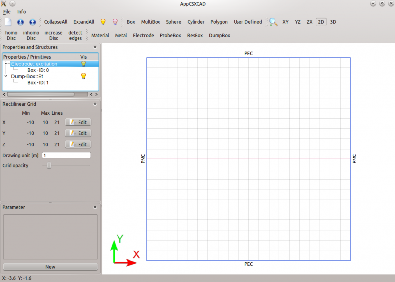
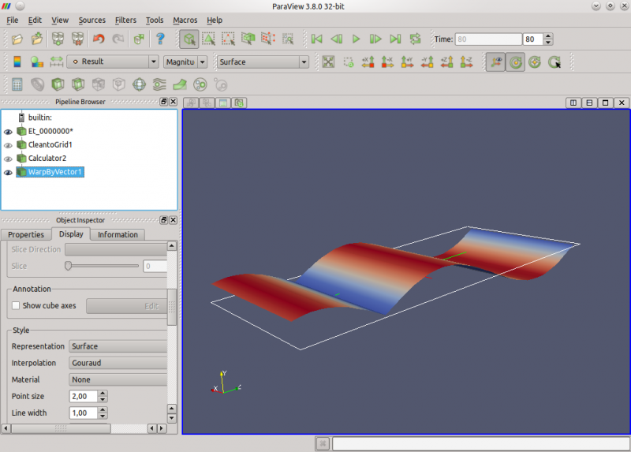

.. _tut_parallel_plate_waveguide:

Parallel Plate Waveguide
==============================

Preface
-----------------------
     
Covered in this tutorial:

* The Matlab/Octave/Python script

* Visualization of the structure

* openEMS output

* Visualization of the result (in follow-up tutorial)

Simulation time: < 1 minute on a contemporary machine

Prerequisites
-----------------------

* make sure you read the :ref:`tutorials primer<tutorials_primer>`

* open the tutorial file

  * Matlab/Octave: ``Parallel_Plate_Waveguide.m``

  * Python: ``Parallel_Plate_Waveguide.py``

Instructions
-----------------------

Simulation Script
^^^^^^^^^^^^^^^^^^^^^^^^^^^^^^^^^^^

1. To start the script within an empty environment, the first lines are:

	.. tabs::
		
		.. tab:: Matlab/Octave
			
			.. code-block:: matlab
			  
				close all
				clear
				clc
		
		.. tab:: Python
		
			.. todo::
				
				Python code missing

2. To specify the FDTD options, we need the FDTD structure:

	.. tabs::
		
		.. tab:: Matlab/Octave
			
			.. code-block:: matlab
			  
				FDTD = InitFDTD('NrTS', 100, 'EndCriteria', 0, 'OverSampling', 50);
				FDTD = SetSinusExcite(FDTD, 10e6);
				FDTD = SetBoundaryCond(FDTD,{'PMC' 'PMC' 'PEC' 'PEC' 'MUR' 'MUR'});

		.. tab:: Python
		
			.. todo::
				
				Python code missing

	The first command inititalizes the FDTD data-structure, setting the number of time steps (NrTS) to 100 with an end criteria of 0. The second command specifies a sinusoidal excitation function (in the time domain) with a frequency of 10 MHz. The third command sets the boundary conditions to model a parallel plate (perfect electric conductor at ymin and ymax). The MUR condition absorbs the propagating wave at zmin and zmax.

3. Next, the CSXCAD geometric library needs to be initialized:

	.. tabs::
		
		.. tab:: Matlab/Octave
			
			.. code-block:: matlab
			  
				CSX = InitCSX();
		
		.. tab:: Python
		
			.. todo::
				
				Python code missing

4. To solve for discrete electromagnetic fields, we need to define a mesh. The default units are metres:

	.. tabs::
		
		.. tab:: Matlab/Octave
			
			.. code-block:: matlab
			  
				mesh.x = -10:10;
				mesh.y = -10:10;
				mesh.z = -10:30;
				CSX = DefineRectGrid(CSX, 1, mesh);
		
		.. tab:: Python
		
			.. todo::
				
				Python code missing

5. Lets add the source to our parallel plate waveguide (spatial domain):

	.. tabs::
		
		.. tab:: Matlab/Octave
			
			.. code-block:: matlab
			  
				CSX = AddExcitation(CSX, 'excitation', 0, [0 1 0]);
				CSX = AddBox(CSX,'excitation', 0, [-10 -10 0], [10 10 0]);
		
		.. tab:: Python
		
			.. todo::
				
				Python code missing

6. We need to define what to observe (here a plane where to record the E-field):

	.. tabs::
		
		.. tab:: Matlab/Octave
			
			.. code-block:: matlab
			  
				CSX = AddDump(CSX, 'Et');
				CSX = AddBox(CSX, 'Et', 0, [-10 0 -10], [10 0 30]);
		
		.. tab:: Python
				
			.. todo::
				
				Python code missing
	
	This rectangle will create a dump of the E-field over time. The dump will be a set of .vtr-files in our temp directory (will be created later). Those files can then be viewed with ParaView (will be done at the end).

7. The final task is to write the FDTD and CSX structure into an XML-file:

	.. tabs::
		
		.. tab:: Matlab/Octave
			
			.. code-block:: matlab
			  
				mkdir('tmp');
				WriteOpenEMS('tmp/tmp.xml', FDTD, CSX);
		
		.. tab:: Python
				
			.. todo::
				
				Python code missing

Visualization of the Structure
^^^^^^^^^^^^^^^^^^^^^^^^^^^^^^^^^^^

8. To have a look at the geometry we define in the octave script, add:

	.. tabs::
		
		.. tab:: Matlab/Octave
			
			.. code-block:: matlab
			  
				CSXGeomPlot('tmp/tmp.xml');
		
		.. tab:: Python
		
			.. todo::
				
				Python code missing

After execution of the script, AppCSXCAD will open automatically. The screenshot shows the XY-plane of our computational area. The excitation box (blue) surrounds the area. The dump box is visible as a red line in the center of the screen (it's an XZ-plane).

	
	The defined geometry

The structure looks good - let's start the simulation.

OpenEMS Simulation
^^^^^^^^^^^^^^^^^^^^^^^^^^^^^^^^^^^

9. Add:

	.. tabs::
		
		.. tab:: Matlab/Octave
			
			.. code-block:: matlab
			  
				RunOpenEMS('tmp','tmp.xml','');
		
		.. tab:: Python
		
			.. todo::
				
				Python code missing

10. Start the script again. Close AppCSXCAD and observe the terminal showing the output of openEMS:

	::
		
		 ---------------------------------------------------------------------- 
		 | openEMS 64bit -- version v0.0.25-18-gc485f04
		 | (C) 2010-2012 Thorsten Liebig <thorsten.liebig@gmx.de>  GPL license
		 ---------------------------------------------------------------------- 
			Used external libraries:
				CSXCAD -- Version: v0.2.4-8-g0fb245a
				hdf5   -- Version: 1.8.4
						  compiled against: HDF5 library version: 1.8.4-patch1
				tinyxml -- compiled against: 2.5.3
				fparser
				boost  -- compiled against: 1_46_1
				vtk -- Version: 5.6.1
					   compiled against: 5.6.1
				MPI -- Version: 2.1
					   compiled against: openMPI1.4.3

		Create FDTD operator (compressed SSE + multi-threading)
		FDTD simulation size: 21x21x41 --> 18081 FDTD cells 
		FDTD timestep is: 1.92583e-09 s; Nyquist rate: 25 timesteps @1.03851e+07 Hz
		Excitation signal length is: 100 timesteps (1.92583e-07s)
		Max. number of timesteps: 100 ( --> 1 * Excitation signal length)
		Create FDTD engine (compressed SSE + multi-threading)
		Running FDTD engine... this may take a while... grab a cup of coffee?!?
		Time for 100 iterations with 18081 cells : 0.21277 sec
		Speed: 8.49791 MCells/s 

Visualization of the Result
^^^^^^^^^^^^^^^^^^^^^^^^^^^^^^^^^^^

OpenEMS has created some result files in the ``tmp`` folder. To view them in ParaView, have a look into the :ref:`ParaView visualization tutorial <vis_paraview_tut>`.

	
	Parallel Plate Waveguide in ParaView
