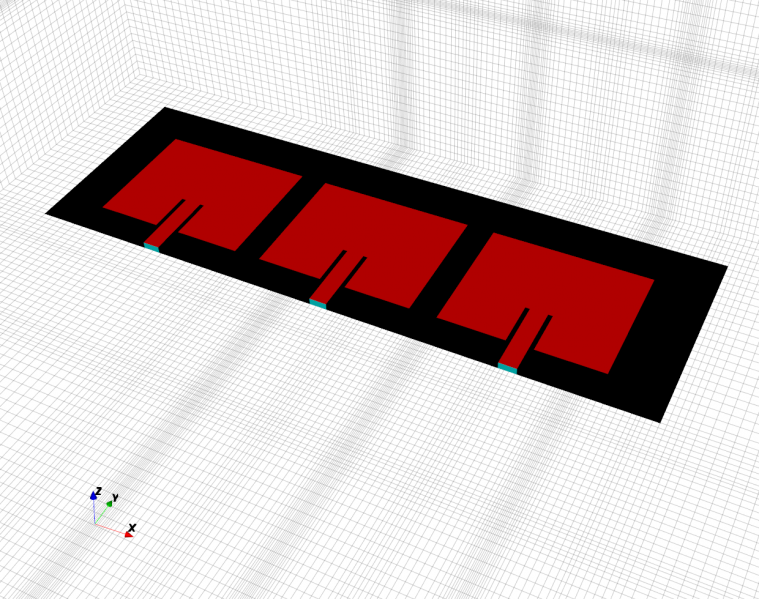
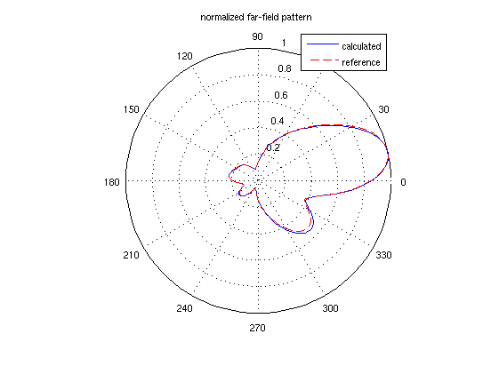
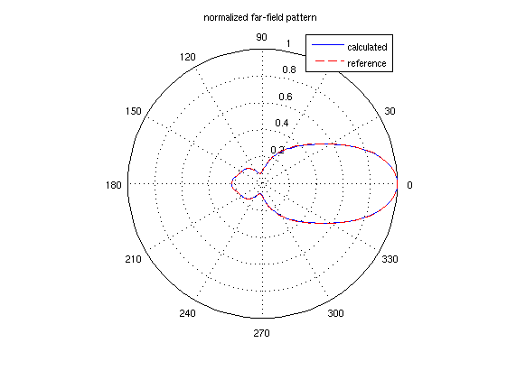
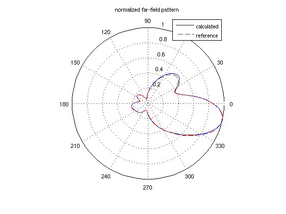

Patch Antenna Phased Array
==============================

Preface
-----------------------
     
Covered in this tutorial:

* Setup of a Patch Antenna Array (see for comparison: :ref:`Simple Patch Antenna <tut_simple_patch_antenna>`)

* Calculate the full set of S-Parameter

* Calculate far-field pattern as a superposition of individual results and attached circuit

Prerequisites
-----------------------

* make sure you read the :ref:`tutorials primer<tutorials_primer>`

* recommended: some experience with openEMS, e.g. by walking through earlier :ref:`tutorials <tutorials>`

* this tutorial also requires the Circuit toolbox, see :ref:`here <install_matlaboctave>`

* open the tutorial files

  * Matlab/Octave: ``Patch_Antenna_Phased_Array.m`` and ``Patch_Antenna_Array.m``

  * Python: ``???.py``

.. todo::

	Python missing

Instructions
-----------------------

This tutorial does not have detailed instructions. Open the tutorial file in Matlab/Octave or Python, and run it.

Note that there are two files: one provides a function to create a patch antenna array, the other one uses it for a phased array.

Results
-----------------------

	
	Patch antenna phased array model

	
	Far-field pattern for C2 = 0.2pF, C3 = 1pF

	
	Far-field pattern for C2 = 0.2pF, C3 = 0.2pF

	
	Far-field pattern for C2 = 1pF, C3 = 0.2pF

References
-----------------------

* Y. Yusuf and X. Gong, “A low-cost patch antenna phased array with analog beam steering using mutual coupling and reactive loading,” IEEE Antennas Wireless Propag. Lett., vol. 7, pp. 81–84, 2008.

* S. Otto, S. Held, A. Rennings, and K. Solbach, "Array and multiport antenna farfield simulation using EMPIRE, MATLAB and ADS," 39th European Microwave Conf. (EuMC 2009), Sept. 29 - Oct. 1, Rome, Italy, pp. 1547-1550, 2009.

* K. Karlsson, J. Carlsson, I. Belov, G. Nilsson, and P.-S. Kildal,Optimization of antenna diversity gain by combining full-wave and circuit simulations, in Proc. Second European Conference on Antennas and Propagation EuCAP 2007, 11-16 Nov. 2007, pp. 1-5.
