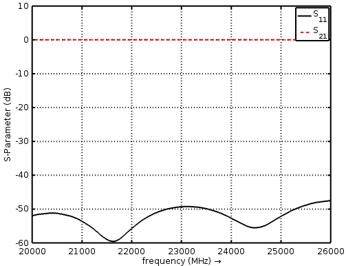
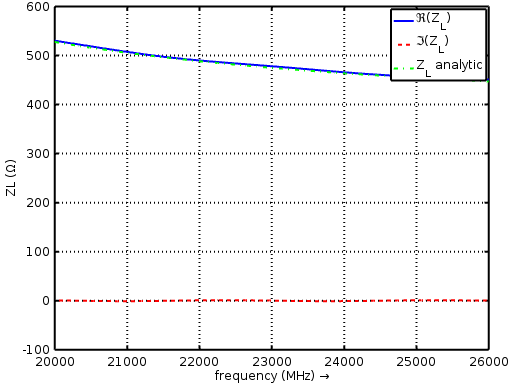
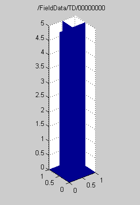

.. _rect_waveguide_tut:

Rectangular Waveguide
==============================

Preface
-----------------------

Covered in this tutorial:

* The Matlab/Octave/Python script
* Visualization of the structure
* openEMS output
* Visualization of the result (follow-up tutorial)

Simulation time: < 1 minute on a contemporary machine

Prerequisites
-----------------------

* make sure you read the :ref:`tutorials primer<tutorials_primer>`

* open the tutorial file

  * Matlab/Octave: ``Rect_Waveguide.py.m``

  * Python: ``Rect_Waveguide.py``

Instructions
-----------------------

Steup
^^^^^^^^^^^^^^

1. To start the script within an empty environment, the first lines are:

	.. tabs::
		
		.. tab:: Matlab/Octave
			
			.. code-block:: matlab
			  
				close all
				clear
				clc
		
		.. tab:: Python
		
			.. todo::
			
				Python missing

2. Setup the simulation, starting with the units:

	.. tabs::
		
		.. tab:: Matlab/Octave
			
			.. code-block:: matlab
			  
				physical_constants;
				unit = 1e-6; %drawing unit in microns
		
		.. tab:: Python
		
			.. todo::
			
				Python missing

3. Next, specify the waveguide dimensions for WR42:

	.. tabs::
		
		.. tab:: Matlab/Octave
			
			.. code-block:: matlab
			  
				a = 10700;   %waveguide width
				b = 4300;    %waveguide height
				length = 50000;
		
		.. tab:: Python
		
			.. todo::
			
				Python missing

4. Specify the frequency range of interest:

	.. tabs::
		
		.. tab:: Matlab/Octave
			
			.. code-block:: matlab
			  
				f_start = 20e9;
				f_0     = 24e9;
				f_stop  = 26e9;
				lambda0 = c0/f_0/unit;
		
		.. tab:: Python
		
			.. todo::
			
				Python missing

	The last instruction gives the wavelength of the centre frequency in microns.

5. Define the waveguide TE mode:

	.. tabs::
		
		.. tab:: Matlab/Octave
			
			.. code-block:: matlab
			  
				TE_mode = 'TE10';
		
		.. tab:: Python
		
			.. todo::
			
				Python missing

6. Specify the mesh resolution as 30 cells per wavelength in all directions:

	.. tabs::
		
		.. tab:: Matlab/Octave
			
			.. code-block:: matlab
			  
				mesh_res = lambda0./[30 30 30];
		
		.. tab:: Python
		
			.. todo::
			
				Python missing

7. Initialize the FDTD structure:

	.. tabs::
		
		.. tab:: Matlab/Octave
			
			.. code-block:: matlab
			  
				FDTD = InitFDTD('NrTS',1e4, 'OverSampling', 5);
				FDTD = SetGaussExcite(FDTD,0.5*(f_start+f_stop),0.5*(f_stop-f_start));
		
		.. tab:: Python
		
			.. todo::
			
				Python missing

8. Set the boundary conditions. The wave is propagating in the z-direction so the ends of the waveguide are terminated with perfectly-matched layers (PML or 3). The sidewalls of the waveguide are formed by the x and y extents of the simulation space using perfect electric conductor (PEC or 0) boundary conditions.

	.. tabs::
		
		.. tab:: Matlab/Octave
			
			.. code-block:: matlab
			  
				BC = [0 0 0 0 3 3]; %pml in pos. and neg. z-direction
				FDTD = SetBoundaryCond(FDTD,BC);
		
		.. tab:: Python
		
			.. todo::
			
				Python missing

9. Now setup the CSXCAD mesh:

	.. tabs::
		
		.. tab:: Matlab/Octave
			
			.. code-block:: matlab
			  
				CSX = InitCSX();
				mesh.x = SmoothMeshLines([0 a], mesh_res(1));
				mesh.y = SmoothMeshLines([0 b], mesh_res(2));
				mesh.z = SmoothMeshLines([0 length], mesh_res(3));
				CSX = DefineRectGrid(CSX, unit,mesh);
		
		.. tab:: Python
		
			.. todo::
			
				Python missing

10. Now specify the waveguide ports. Port 1 is 11 cells from the bottom end of the waveguide and port 2 is 13 cells from the top end. Ports are in the form of a box with the excitation plane located at the start position and the voltage and current probes located at the stop position. The stop position specifies the reference plane for the port. Port 1 is active with an amplitude of 1 while the second port is passive (no excitation amplitude specified).

	.. tabs::
		
		.. tab:: Matlab/Octave
			
			.. code-block:: matlab
			  
				start=[mesh.x(1)   mesh.y(1)   mesh.z(11)];
				stop =[mesh.x(end) mesh.y(end) mesh.z(15)];
				[CSX, port{1}] = AddRectWaveGuidePort( CSX, 0, 1, start, stop, 'z', a*unit, b*unit, TE_mode, 1);
				 
				start=[mesh.x(1)   mesh.y(1)   mesh.z(end-13)];
				stop =[mesh.x(end) mesh.y(end) mesh.z(end-14)];
				[CSX, port{2}] = AddRectWaveGuidePort( CSX, 0, 2, start, stop, 'z', a*unit, b*unit, TE_mode);
		
		.. tab:: Python
		
			.. todo::
			
				Python missing

11. Define a dump box to capture time-domain E-field results:

	.. tabs::
		
		.. tab:: Matlab/Octave
			
			.. code-block:: matlab
			  
				CSX = AddDump(CSX,'Et','FileType',1,'SubSampling','2,2,2');
				start = [mesh.x(1)   mesh.y(1)   mesh.z(1)];
				stop  = [mesh.x(end) mesh.y(end) mesh.z(end)];
				CSX = AddBox(CSX,'Et',0 , start,stop);
		
		.. tab:: Python
		
			.. todo::
			
				Python missing

12. Write the simulation model and execute the simulation:

	.. tabs::
		
		.. tab:: Matlab/Octave
			
			.. code-block:: matlab
			  
				Sim_Path = 'tmp_mod';
				Sim_CSX = 'rect_wg.xml';
				 
				[status, message, messageid] = rmdir(Sim_Path,'s');
				[status, message, messageid] = mkdir(Sim_Path);
				 
				WriteOpenEMS([Sim_Path '/' Sim_CSX],FDTD,CSX);
				 
				RunOpenEMS(Sim_Path, Sim_CSX)
		
		.. tab:: Python
		
			.. todo::
			
				Python missing

Results
^^^^^^^^^^^^^^^^^

13. Here are the post-processing steps to calculate the s-parameters and waveguide impedance:

	.. tabs::
		
		.. tab:: Matlab/Octave
			
			.. code-block:: matlab
			  
				freq = linspace(f_start,f_stop,201);
				port = calcPort(port, Sim_Path, freq);
				 
				s11 = port{1}.uf.ref./ port{1}.uf.inc;
				s21 = port{2}.uf.ref./ port{1}.uf.inc;
				ZL = port{1}.uf.tot./port{1}.if.tot;
				ZL_a = port{1}.ZL; % analytic waveguide impedance
		
		.. tab:: Python
		
			.. todo::
			
				Python missing

	Note that ``uf`` refers to the frequency-domain voltages, ``if`` refers to the frequency-domain currents, ``inc`` refers to incident, ``ref`` refers to reflected, and ``tot`` refers to total.

14. Plot the s-parameters:

	.. tabs::
		
		.. tab:: Matlab/Octave
			
			.. code-block:: matlab
				
				figure
				plot(freq*1e-6,20*log10(abs(s11)),'k-','Linewidth',2);
				xlim([freq(1) freq(end)]*1e-6);
				grid on;
				hold on;
				plot(freq*1e-6,20*log10(abs(s21)),'r--','Linewidth',2);
				l = legend('S_{11}','S_{21}','Location','Best');
				set(l,'FontSize',12);
				ylabel('S-Parameter (dB)','FontSize',12);
				xlabel('frequency (MHz) \rightarrow','FontSize',12);
		
		.. tab:: Python
		
			.. todo::
			
				Python missing

	
	S-Parameters

15. Compare analytic and numerical wave-impedance:

	.. tabs::
		
		.. tab:: Matlab/Octave
			
			.. code-block:: matlab
			  
				figure
				plot(freq*1e-6,real(ZL),'Linewidth',2);
				hold on;
				grid on;
				plot(freq*1e-6,imag(ZL),'r--','Linewidth',2);
				plot(freq*1e-6,ZL_a,'g-.','Linewidth',2);
				ylabel('ZL (\Omega)','FontSize',12);
				xlabel('frequency (MHz) \rightarrow','FontSize',12);
				xlim([freq(1) freq(end)]*1e-6);
				l = legend('\Re(Z_L)','\Im(Z_L)','Z_L analytic','Location','Best');
				set(l,'FontSize',12);
		
		.. tab:: Python
		
			.. todo::
			
				Python missing

	
	Impedance

16. Plot the field dumps:

	.. tabs::
		
		.. tab:: Matlab/Octave
			
			.. code-block:: matlab
			  
				figure
				dump_file = [Sim_Path '/Et.h5'];
				PlotArgs.slice = {a/2*unit b/2*unit 0};
				PlotArgs.pauseTime=0.01;
				PlotArgs.component=0;
				PlotArgs.Limit = 'auto';
				PlotHDF5FieldData(dump_file, PlotArgs)
		
		.. tab:: Python
		
			.. todo::
			
				Python missing

	
	Animated field dump
