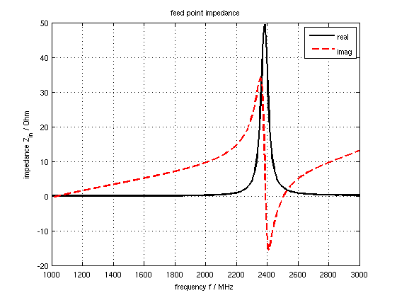
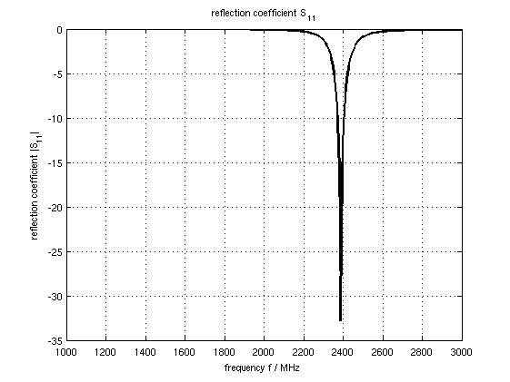
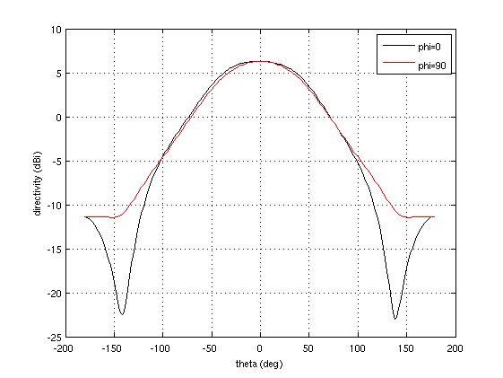

.. _tut_simple_patch_antenna:

Simple Patch Antenna
==============================

Preface
-----------------------
     
Covered in this tutorial:

* Setup patch, substrate and ground

* Setup a lumped feeding port

* Adding a near-field to far-field (NF2FF) box

* Calculate the S-Parameter of the antenna

* Calculate and plot the far-field pattern

Simulation time: < 1 minute on a contemporary machine

Prerequisites
-----------------------

* make sure you read the :ref:`tutorials primer<tutorials_primer>`

* open the tutorial file

  * Matlab/Octave: ``Simple_Patch_Antenna.m``

  * Python: ``???.py``

Instructions
-----------------------

1. Start the script within an empty environment:

	.. tabs::
		
		.. tab:: Matlab/Octave
			
			.. code-block:: matlab
			  
				close all
				clear
				clc
		
		.. tab:: Python
		
			.. todo::
			
				Python missing

2. Setup the physical constants and antenna parameters

	.. tabs::
		
		.. tab:: Matlab/Octave
			
			.. code-block:: matlab
			  
				physical_constants;
				unit = 1e-3; % all length in mm
				 
				% patch width in x-direction
				patch.width  = 30; % resonant length
				% patch length in y-direction
				patch.length = 40;
				 
				%substrate setup
				substrate.epsR   = 3.38;
				substrate.kappa  = 1e-3 * 2*pi*2.45e9 * EPS0*substrate.epsR;
				substrate.width  = 60;
				substrate.length = 60;
				substrate.thickness = 1.524;
				substrate.cells = 4;
				 
				%setup feeding
				feed.pos = -5.5; %feeding position in x-direction
				feed.width = 2;  %feeding port width
				feed.R = 50;     %feed resistance
				 
				% size of the simulation box
				SimBox = [200 200 100];
		
		.. tab:: Python
		
			.. todo::
			
				Python missing

3. Setup FDTD parameters, excitation signals and boundary conditions

	.. tabs::
		
		.. tab:: Matlab/Octave
			
			.. code-block:: matlab
			  
				f0 = 2e9; % center frequency
				fc = 1e9; % 20 dB corner frequency
				FDTD = InitFDTD('NrTS', 30000 );
				FDTD = SetGaussExcite( FDTD, f0, fc );
				BC = {'MUR' 'MUR' 'MUR' 'MUR' 'MUR' 'MUR'}; % boundary conditions
				FDTD = SetBoundaryCond( FDTD, BC );
		
		.. tab:: Python
		
			.. todo::
			
				Python missing

4. Setup the CSXCAD mesh

	.. tabs::
		
		.. tab:: Matlab/Octave
			
			.. code-block:: matlab
			  
				max_res = c0 / (f0+fc) / unit / 20; % cell size: lambda/20
				CSX = InitCSX();
				 
				%create fixed lines for the simulation box, substrate and port
				mesh.x = [-SimBox(1)/2 SimBox(1)/2 -substrate.width/2 substrate.width/2 -patch.width/2 patch.width/2 feed.pos];
				mesh.x = SmoothMeshLines( mesh.x, max_res, 1.4); % create a smooth mesh between specified fixed mesh lines
				 
				mesh.y = [-SimBox(2)/2 SimBox(2)/2 -substrate.length/2 substrate.length/2 -feed.width/2 feed.width/2 -patch.length/2 patch.length/2];
				mesh.y = SmoothMeshLines( mesh.y, max_res, 1.4 );
				 
				%create fixed lines for the simulation box and given number of lines inside the substrate
				mesh.z = [-SimBox(3)/2 linspace(0,substrate.thickness,substrate.cells) SimBox(3)/2 ];
				mesh.z = SmoothMeshLines( mesh.z, max_res, 1.4 );
				 
				CSX = DefineRectGrid( CSX, unit, mesh );
		
		.. tab:: Python
		
			.. todo::
			
				Python missing

5. Setup the geometry

	.. tabs::
		
		.. tab:: Matlab/Octave
			
			.. code-block:: matlab
			  
				%% create patch
				CSX = AddMetal( CSX, 'patch' ); % create a perfect electric conductor (PEC)
				start = [-patch.width/2 -patch.length/2 substrate.thickness];
				stop  = [ patch.width/2  patch.length/2 substrate.thickness];
				CSX = AddBox(CSX,'patch',10,start,stop); % add a box-primitive to the metal property 'patch'
				 
				%% create substrate
				CSX = AddMaterial( CSX, 'substrate' );
				CSX = SetMaterialProperty( CSX, 'substrate', 'Epsilon', substrate.epsR, 'Kappa', substrate.kappa );
				start = [-substrate.width/2 -substrate.length/2 0];
				stop  = [ substrate.width/2  substrate.length/2 substrate.thickness];
				CSX = AddBox( CSX, 'substrate', 0, start, stop );
				 
				%% create ground (same size as substrate)
				CSX = AddMetal( CSX, 'gnd' ); % create a perfect electric conductor (PEC)
				start(3)=0;
				stop(3) =0;
				CSX = AddBox(CSX,'gnd',10,start,stop);
		
		.. tab:: Python
		
			.. todo::
			
				Python missing

6. Setup the feeding port as a lumped port with 50 Ohms

	.. tabs::
		
		.. tab:: Matlab/Octave
			
			.. code-block:: matlab
			  
				start = [feed.pos-.1 -feed.width/2 0];
				stop  = [feed.pos+.1 +feed.width/2 substrate.thickness];
				[CSX port] = AddLumpedPort(CSX, 5 ,1 ,feed.R, start, stop, [0 0 1], true);
		
		.. tab:: Python
		
			.. todo::
			
				Python missing

7. Add a nf2ff box

	.. tabs::
		
		.. tab:: Matlab/Octave
			
			.. code-block:: matlab
			  
				SimBox = SimBox - max_res * 4; %reduced SimBox size for nf2ff box
				[CSX nf2ff] = CreateNF2FFBox(CSX, 'nf2ff', -SimBox/2, SimBox/2);
		
		.. tab:: Python
		
			.. todo::
			
				Python missing

8. Create simulation folder, write xml simulation file, visualize the Geometry using AppCSXCAD, and finally run openEMS

	.. tabs::
		
		.. tab:: Matlab/Octave
			
			.. code-block:: matlab
			  
				%% prepare simulation folder
				Sim_Path = 'tmp';
				Sim_CSX = 'patch_ant.xml';
				 
				[status, message, messageid] = rmdir( Sim_Path, 's' ); % clear previous directory
				[status, message, messageid] = mkdir( Sim_Path ); % create empty simulation folder
				 
				%% write openEMS compatible xml-file
				WriteOpenEMS( [Sim_Path '/' Sim_CSX], FDTD, CSX );
				 
				%% show the structure
				CSXGeomPlot( [Sim_Path '/' Sim_CSX] );
				 
				%% run openEMS
				RunOpenEMS( Sim_Path, Sim_CSX );
		
		.. tab:: Python
		
			.. todo::
			
				Python missing

Post-Processing
^^^^^^^^^^^^^^^^^^^^^^

9. Read in port voltages and currents

	.. tabs::
		
		.. tab:: Matlab/Octave
			
			.. code-block:: matlab
			  
				freq = linspace( max([1e9,f0-fc]), f0+fc, 501 );
				port = calcPort(port, Sim_Path, freq);
		
		.. tab:: Python
		
			.. todo::
			
				Python missing

10. Calculate & plot antenna input-impedance

	.. tabs::
		
		.. tab:: Matlab/Octave
			
			.. code-block:: matlab
			  
				Zin = port.uf.tot ./ port.if.tot;
				s11 = port.uf.ref ./ port.uf.inc;
				P_in = 0.5 * port.uf.inc .* conj( port.if.inc ); % antenna feed power
				 
				% plot feed point impedance
				figure
				plot( freq/1e6, real(Zin), 'k-', 'Linewidth', 2 );
				hold on
				grid on
				plot( freq/1e6, imag(Zin), 'r--', 'Linewidth', 2 );
				title( 'feed point impedance' );
				xlabel( 'frequency f / MHz' );
				ylabel( 'impedance Z_{in} / Ohm' );
				legend( 'real', 'imag' );
		
		.. tab:: Python
		
			.. todo::
			
				Python missing

11. Calculate & Plot S-Parameter and accepted power

	.. tabs::
		
		.. tab:: Matlab/Octave
			
			.. code-block:: matlab
				
				figure
				plot( freq/1e6, 20*log10(abs(s11)), 'k-', 'Linewidth', 2 );
				grid on
				title( 'reflection coefficient S_{11}' );
				xlabel( 'frequency f / MHz' );
				ylabel( 'reflection coefficient |S_{11}|' );
				 
				drawnow
		
		.. tab:: Python
		
			.. todo::
			
				Python missing

12. Calculate & Plot antenna parameter & radiation pattern

	.. tabs::
		
		.. tab:: Matlab/Octave
			
			.. code-block:: matlab
			  
				%% NFFF contour plots
				%find resonance frequency from s11
				f_res_ind = find(s11==min(s11));
				f_res = freq(f_res_ind);
				 
				% calculate the far field at phi=0 degrees and at phi=90 degrees
				disp( 'calculating far field at phi=[0 90] deg...' );
				 
				nf2ff = CalcNF2FF(nf2ff, Sim_Path, f_res, [-180:2:180]*pi/180, [0 90]*pi/180);
				 
				% display power and directivity
				disp( ['radiated power: Prad = ' num2str(nf2ff.Prad) ' Watt']);
				disp( ['directivity: Dmax = ' num2str(nf2ff.Dmax) ' (' num2str(10*log10(nf2ff.Dmax)) ' dBi)'] );
				disp( ['efficiency: nu_rad = ' num2str(100*nf2ff.Prad./real(P_in(f_res_ind))) ' %']);
				 
				% normalized directivity as polar plot
				figure
				polarFF(nf2ff,'xaxis','theta','param',[1 2],'normalize',1)
				 
				% log-scale directivity plot
				figure
				plotFFdB(nf2ff,'xaxis','theta','param',[1 2])
				% conventional plot approach
				% plot( nf2ff.theta*180/pi, 20*log10(nf2ff.E_norm{1}/max(nf2ff.E_norm{1}(:)))+10*log10(nf2ff.Dmax));
				 
				drawnow
				 
				%%
				disp( 'calculating 3D far field pattern and dumping to vtk (use Paraview to visualize)...' );
				thetaRange = (0:2:180);
				phiRange = (0:2:360) - 180;
				nf2ff = CalcNF2FF(nf2ff, Sim_Path, f_res, thetaRange*pi/180, phiRange*pi/180,'Verbose',1,'Outfile','3D_Pattern.h5');
				 
				figure
				plotFF3D(nf2ff,'logscale',-20);
				 
				 
				E_far_normalized = nf2ff.E_norm{1} / max(nf2ff.E_norm{1}(:)) * nf2ff.Dmax;
				DumpFF2VTK([Sim_Path '/3D_Pattern.vtk'],E_far_normalized,thetaRange,phiRange,'scale',1e-3);
		
		.. tab:: Python
		
			.. todo::
			
				Python missing

Results
------------------

	
	Antenna input impedance
	

	
	Antenna return loss

	
	Antenna radiation pattern

Further Steps
--------------------------

* Use the one-third/two-third method to enhance thin-metal accuracy
* 3D radiation pattern plot (included in openEMS/matlab/examples/antennas/patch_antenna.m)
* create a patch array (included in openEMS/matlab/examples/antennas/patch_antenna_array.m)
