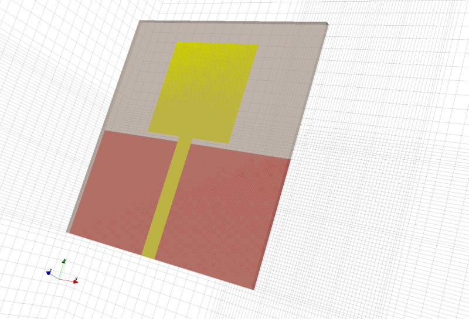
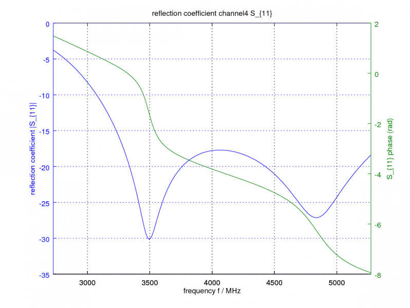
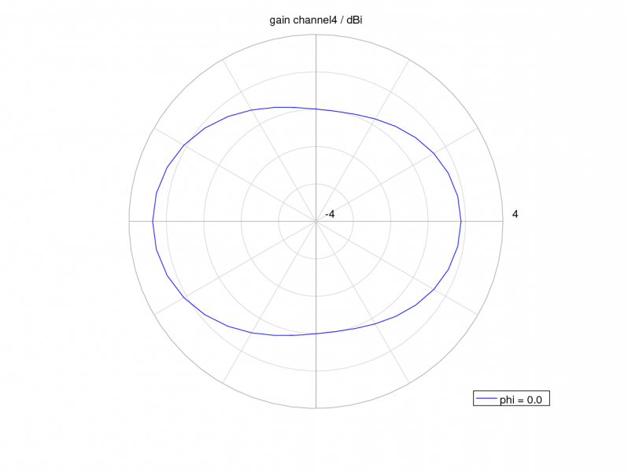
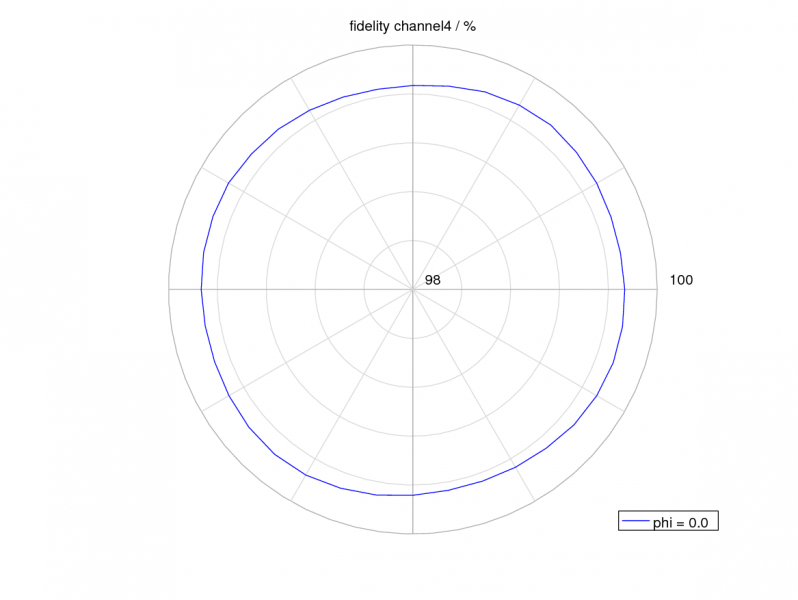

UWB Radar
==============================

Preface
-----------------------
     
Covered in this tutorial:

* Setup an ultra-wide-band (UWB) antenna

* Advanced meshing

* Calculate and visualize UWB radar parameter

Simulation time: ≈ 3 minutes on a contemporary machine

Prerequisites
-----------------------

* make sure you read the :ref:`tutorials primer<tutorials_primer>`

* recommended: some experience with openEMS, e.g. by walking through earlier :ref:`tutorials <tutorials>`

* open the tutorial file

  * Matlab/Octave: ``RadarUWBTutorial.m``

  * Python: ``???.py``

.. todo::

	Python Missing

Instructions
-----------------------

This tutorial does not have detailed instructions. Open the tutorial file in Matlab/Octave or Python, and run it.

Results
-----------------------

	
	The UWB antenna geometry

	
	UWB Antenna input reflection
	

	
	Farfield Pattern (Channel 4)
	

	
	Fidelity (Channel 4)

