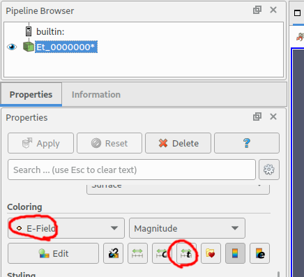
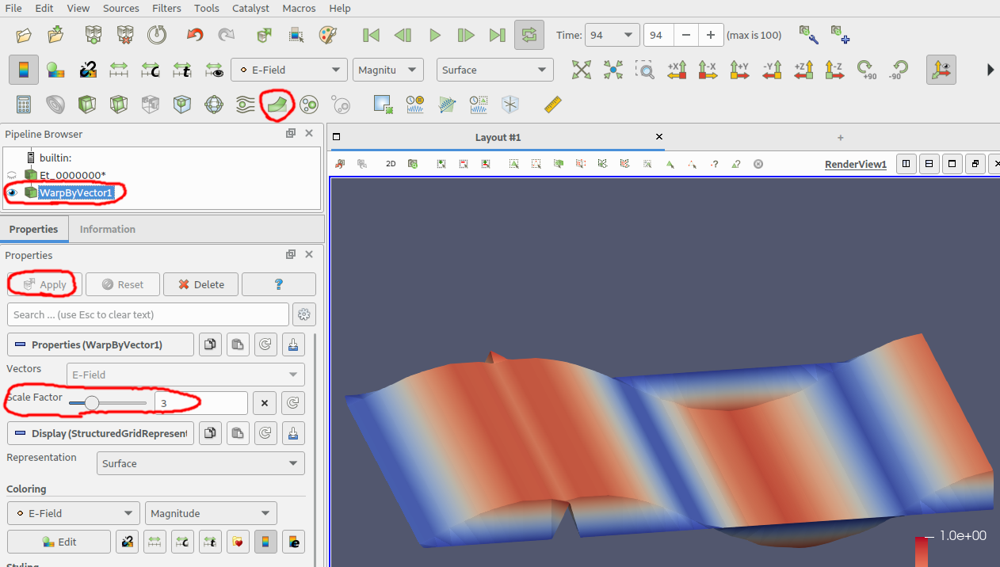

.. _vis_paraview_tut:

Visualization with Paraview
==============================

Preface
-----------------------
     
Covered in this tutorial:

* Visualization of dumped data with ParaView

Prerequisites
-----------------------

* make sure you read the :ref:`tutorials primer<tutorials_primer>`

* make sure ParaView is installed (:ref:`see also here <install_paraview>`)

* create some VTK data, e.g. with the :ref:`parallel plate waveguide tutorial <tut_parallel_plate_waveguide>`

Instructions
-----------------------

Import and Animate
^^^^^^^^^^^^^^^^^^^^^

openEMS has created some result files in the output folder (which is typically called "tmp" in the tutorials). Start ParaView to visualize the E-field saved by the dump box definition:

1. In the main menu, choose *File*, then *Open*, navigate to the output folder and select the ``Et_..vtr`` file.

	openEMS generates a series of .vtr-files, which ParaView conveniently represents as a group

	
	Open the group of .vtr-files
	
2. under *Properties*, click *Apply*

	
	Click *Apply*

3. under *Properties* / *Coloring*, select *E-Field*, then click *Rescale to data range over all timesteps* (either in the toolbar, or under *Properties*)

	
	Adjust coloring

4. Click the *Play* button in the toolbar

	
	Play animation

.. hint::

	If you experience convergence problems with your simulation (e.g. the simulation never stops, as the energy does not drop below the threshold), use this technique to inspect what's going on. You might be able to figure out which component is causing trouble, then adjust that component in the script. See also :ref:`troubleshooting <troubleshooting>`.

Apply Filters
^^^^^^^^^^^^^^^^^^^

Add a *Warp By Vector* filter:
	
1. Use the toolbar button, or the main menu (*Filters* / *Common* / *Warp By Vector*)

2. Click *Apply*

3. Rotate the 3D view to nicely see the the 3D model

4. Click *Play*

5. If necessary: stop, adjust the *Scale Factor* of the filter, click *Apply* again, then *Play*

	
	Using the *Warp By Vector* filter

Further Steps
^^^^^^^^^^^^^^^^^^^

If you want to learn more about ParaView, have a look into the tutorials at the `ParaView website <https://www.paraview.org/tutorials/>`_.
